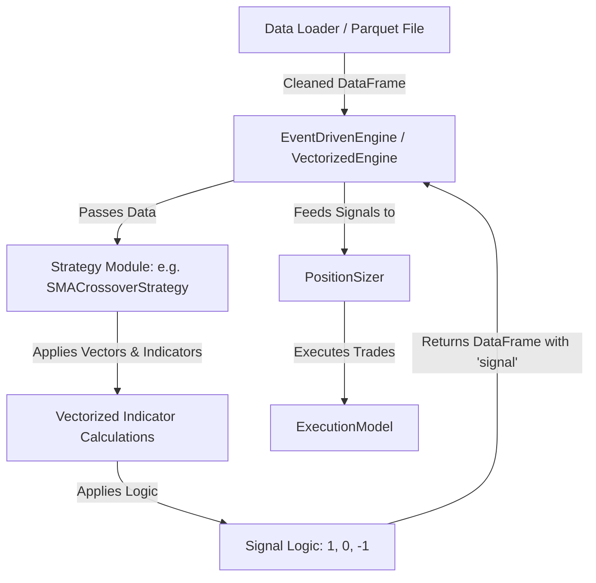

# Phase 3 Implementation Plan: Strategy Modules

This document outlines the design and implementation plan for the **Phase 3 Strategy Modules** of the Backtesting Suite. Each trading strategy will be created as a separate, self-contained Python module inside the `strat/` directory, inheriting from the abstract [BaseStrategy](file:///C:/Users/bigbo/Spy_Backtest/strat/base.py#L5-L22) class.

---

## 1. Strategy Integration Architecture

All strategies will consume a standard OHLCV historical market data `pd.DataFrame` and produce an output `pd.DataFrame` with an added or updated `signal` column.



### Signal Specifications
- `1.0`: Buy / Go Long
- `-1.0`: Sell / Go Short (for long-short systems)
- `0.0`: Cash / Go Flat (exit position)

> [!IMPORTANT]
> To prevent **look-ahead bias**, all indicators and signals must be computed on the closed bar of the timestamp. The [EventDrivenEngine](file:///C:/Users/bigbo/Spy_Backtest/backtest/event_driven.py#L9-L183) already handles chronological execution by evaluating the signal generated at `t-1` to execute order sizes at the Open or Close of bar `t`. Thus, strategy signal generation must not shift signals; the engine will handle shifting.

---

## 2. Strategy Specifications

We will implement six standard strategies, allowing configuring whether they are **long-only** or **long-short** via a constructor argument.

### 2.1 Buy & Hold (Baseline)
- **Module File**: `strat/buy_and_hold.py`
- **Class Name**: `BuyAndHoldStrategy`
- **Description**: The baseline model. Simply goes long on the first available data point and holds the position.
- **Implementation**:
  ```python
  import pandas as pd
  from strat.base import BaseStrategy

  class BuyAndHoldStrategy(BaseStrategy):
      """
      Baseline strategy that buys on day 1 and holds forever.
      """
      def generate_signals(self, data: pd.DataFrame) -> pd.DataFrame:
          df = data.copy()
          df["signal"] = 1.0
          return df
  ```

---

### 2.2 Simple Moving Average (SMA) Crossover
- **Module File**: `strat/sma_crossover.py`
- **Class Name**: `SMACrossoverStrategy`
- **Parameters**:
  - `fast_window` (default: 50): Lookback window for the fast SMA.
  - `slow_window` (default: 200): Lookback window for the slow SMA.
  - `long_only` (default: True): If True, short signals (`-1`) are replaced with flat (`0`).
- **Mathematical Formula**:
  $$\text{SMA}_n = \frac{1}{n} \sum_{i=0}^{n-1} P_{t-i}$$
- **Signal Logic**:
  - **Go Long**: Fast SMA > Slow SMA
  - **Go Short / Flat**: Fast SMA $\le$ Slow SMA
  - **Cold Start**: Pre-slow window points are set to `0.0` to avoid partial window calculations.

---

### 2.3 Exponential Moving Average (EMA) Crossover
- **Module File**: `strat/ema_crossover.py`
- **Class Name**: `EMACrossoverStrategy`
- **Parameters**:
  - `fast_window` (default: 12): Lookback span for the fast EMA.
  - `slow_window` (default: 26): Lookback span for the slow EMA.
  - `long_only` (default: True): If True, short signals are replaced with flat (`0`).
- **Mathematical Formula**:
  $$\text{EMA}_t = \left( P_t \times \frac{2}{n+1} \right) + \left( \text{EMA}_{t-1} \times \left(1 - \frac{2}{n+1}\right) \right)$$
- **Signal Logic**:
  - **Go Long**: Fast EMA > Slow EMA
  - **Go Short / Flat**: Fast EMA $\le$ Slow EMA

---

### 2.4 RSI Mean Reversion
- **Module File**: `strat/rsi_mean_reversion.py`
- **Class Name**: `RSIMeanReversionStrategy`
- **Parameters**:
  - `window` (default: 14): Lookback period for RSI.
  - `oversold` (default: 30.0): Threshold below which the asset is considered oversold (Buy trigger).
  - `overbought` (default: 70.0): Threshold above which the asset is considered overbought (Sell / Exit trigger).
  - `exit_level` (default: 50.0): Mean value used as exit criteria to close positions (e.g. exit long position when RSI crosses above 50).
  - `long_only` (default: True)
- **Mathematical Formula** (Wilder's Smoothing):
  $$\text{RS} = \frac{\text{EMA}(\text{U}, \alpha = 1/\text{window})}{\text{EMA}(\text{D}, \alpha = 1/\text{window})}$$
  $$\text{RSI} = 100 - \frac{100}{1 + \text{RS}}$$
  Where $U = \max(\Delta P, 0)$ and $D = \max(-\Delta P, 0)$.
- **Signal Logic**:
  - *State-based logic* (using loop-free vectorized forward filling):
    - Set signal to `1` when $\text{RSI} < \text{oversold}$.
    - Set signal to `0` (or `-1` if long-short) when $\text{RSI} > \text{exit\_level}$ (or $\text{RSI} > \text{overbought}$).
    - Forward-fill intermediate states to maintain position.

---

### 2.5 Bollinger Bands Breakout
- **Module File**: `strat/bollinger_bands.py`
- **Class Name**: `BollingerBandsStrategy`
- **Parameters**:
  - `window` (default: 20): Rolling SMA window.
  - `num_std` (default: 2.0): Standard deviation multiplier for bands.
  - `long_only` (default: True)
- **Mathematical Formula**:
  $$\text{Middle Band} = \text{SMA}_w$$
  $$\text{Upper Band} = \text{SMA}_w + (k \times \sigma_w)$$
  $$\text{Lower Band} = \text{SMA}_w - (k \times \sigma_w)$$
- **Signal Logic**:
  - **Go Long**: Close price breaks *above* Upper Band.
  - **Go Short / Flat**: Close price breaks *below* Lower Band.
  - **Hold**: Forward fill signals between band boundaries.

---

### 2.6 MACD Trend Following
- **Module File**: `strat/macd.py`
- **Class Name**: `MACDStrategy`
- **Parameters**:
  - `fast_window` (default: 12): Fast EMA span.
  - `slow_window` (default: 26): Slow EMA span.
  - `signal_window` (default: 9): Signal Line EMA span.
  - `long_only` (default: True)
- **Mathematical Formula**:
  $$\text{MACD Line} = \text{EMA}(P, \text{fast}) - \text{EMA}(P, \text{slow})$$
  $$\text{Signal Line} = \text{EMA}(\text{MACD Line}, \text{signal\_window})$$
  $$\text{Histogram} = \text{MACD Line} - \text{Signal Line}$$
- **Signal Logic**:
  - **Go Long**: MACD Line > Signal Line (Histogram is positive)
  - **Go Short / Flat**: MACD Line $\le$ Signal Line (Histogram is negative)

---

## 3. Vectorized Pandas Code Design

To ensure optimal execution speeds and clean codebase patterns, each strategy will follow high-performance Pandas styling.

Example for **MACD Trend Following**:
```python
import pandas as pd
import numpy as np
from strat.base import BaseStrategy

class MACDStrategy(BaseStrategy):
    def __init__(self, fast_window: int = 12, slow_window: int = 26, signal_window: int = 9, long_only: bool = True):
        self.fast_window = fast_window
        self.slow_window = slow_window
        self.signal_window = signal_window
        self.long_only = long_only

    def generate_signals(self, data: pd.DataFrame) -> pd.DataFrame:
        df = data.copy()
        
        # Calculate EMAs
        fast_ema = df["close"].ewm(span=self.fast_window, adjust=False).mean()
        slow_ema = df["close"].ewm(span=self.slow_window, adjust=False).mean()
        
        # MACD metrics
        df["macd_line"] = fast_ema - slow_ema
        df["macd_signal"] = df["macd_line"].ewm(span=self.signal_window, adjust=False).mean()
        
        # Signal assignment
        df["signal"] = np.where(df["macd_line"] > df["macd_signal"], 1.0, -1.0 if not self.long_only else 0.0)
        
        # Handle minimum warm-up period
        warmup = max(self.fast_window, self.slow_window) + self.signal_window
        df.iloc[:warmup, df.columns.get_loc("signal")] = 0.0
        
        return df
```

---

## 4. Testing & Validation Strategy

A new test module [test_strategies.py](file:///C:/Users/bigbo/Spy_Backtest/test/test_strategies.py) will be added to verify:
1. **Indicator Accuracy**: Hand-calculated indicator checks on small sample dataframes.
2. **Signal Integrity**: Verification that signals do not incorporate future information (e.g. shift bugs).
3. **Boundary Conditions**: Ensure zero/flat signals during warm-up periods.
4. **Execution Test**: Run each strategy through the `EventDrivenEngine` with various position sizers (`FixedSharesSizer`, `FixedFractionalSizer`, `VolatilityBasedSizer`) to confirm portfolio compatibility.

We will run tests using:
```bash
pytest test/test_strategies.py -v
```

---

## 5. Execution Plan

If approved, the task will proceed as follows:
1. **Implement Strategy Files**:
   - Create `strat/buy_and_hold.py`
   - Create `strat/sma_crossover.py`
   - Create `strat/ema_crossover.py`
   - Create `strat/rsi_mean_reversion.py`
   - Create `strat/bollinger_bands.py`
   - Create `strat/macd.py`
2. **Update Init**: Expose classes in [strat/\_\_init\_\_.py](file:///C:/Users/bigbo/Spy_Backtest/strat/__init__.py).
3. **Implement Tests**: Write testing suites in [test_strategies.py](file:///C:/Users/bigbo/Spy_Backtest/test/test_strategies.py).
4. **Test Run**: Run pytest to guarantee 100% test coverage and correctness.
5. **Baseline Comparison**: Present a short analytical comparison of these strategies using SPY daily data.
