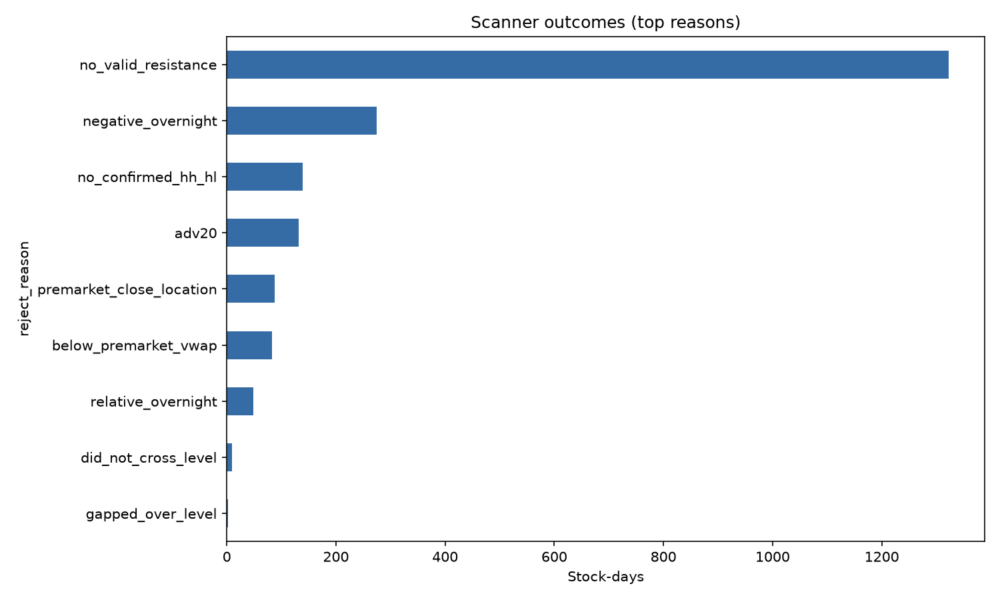
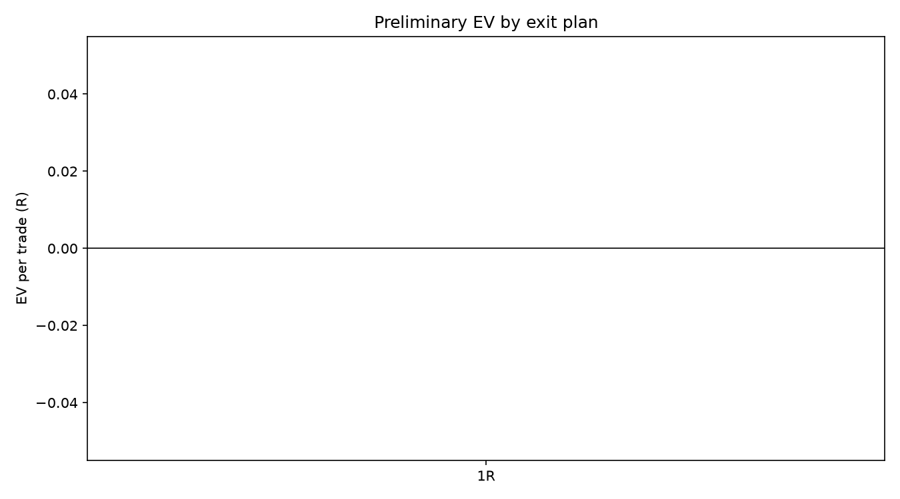
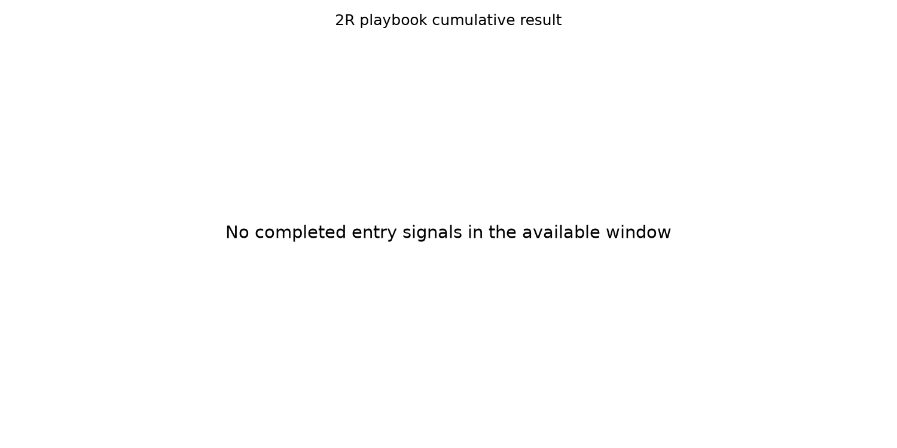

# Premarket Psychological-Resistance Breakout — yfinance Qualification Pilot

**Verdict: DO NOT PROMOTE YET — CONTINUE DATA COLLECTION / RULE REVIEW**

> This is a recent, current-constituent, survivorship-biased pilot. It determines whether structured paper collection is warranted; it does not establish a durable trading edge.

## Coverage

- Current S&P 500 symbols requested: **503**
- Symbols passing the recent 20-day 10M-share liquidity screen with usable one-minute data: **105**
- Usable sessions: **20** (2026-07-06 to 2026-07-31)
- Premarket scanner candidates: **11**
- Premarket candidates per five-session week: **2.75**
- Completed breakout signals: **0**
- Completed signals per five-session week: **0.00**

## Exit-plan comparison

| target_plan | trades | win_rate | loss_rate | avg_win_r | avg_loss_r | ev_r | total_r | net_pnl |
| --- | --- | --- | --- | --- | --- | --- | --- | --- |
| 1R | 0 | n/a | n/a | n/a | n/a | n/a | 0.000 | 0.0 |
| 1.5R | 0 | n/a | n/a | n/a | n/a | n/a | 0.000 | 0.0 |
| 2R | 0 | n/a | n/a | n/a | n/a | n/a | 0.000 | 0.0 |
| 2.5R | 0 | n/a | n/a | n/a | n/a | n/a | 0.000 | 0.0 |
| 3R | 0 | n/a | n/a | n/a | n/a | n/a | 0.000 | 0.0 |
| 1R/2R/3R | 0 | n/a | n/a | n/a | n/a | n/a | 0.000 | 0.0 |

`net_pnl` uses the configured $100 planned risk per signal. EV in R is the primary comparison. Realized losses are not forced to exactly -1R because the simulation includes adverse stop slippage.

## Baseline 2R interpretation

No candidate completed the frozen first-five-minute entry trigger. Win rate, average reward, average loss and EV are therefore **undefined**, not zero.

The 11 premarket candidates remain useful for blind manual review: 2 opened above the resistance zone and 9 failed to cross it.

The scanner frequency (2.75 candidates per five-session week) is adequate for manual chart review, but the exact entry trigger generated no trades. The next pre-registered hypothesis should treat gap-over-and-retest as a separate setup rather than retroactively counting those gaps as breakouts.

## Causal safeguards

- Daily levels use only bars completed before the session.
- Five-right-bar daily pivots and two-right-bar one-minute pivots activate only after confirmation.
- Premarket information stops at 9:29 ET.
- The opening candle is strictly 9:30–9:34 ET; entry is no earlier than the 9:35 one-minute open.
- If a one-minute bar touches stop and target, the stop is assumed to occur first.
- Scale-out stop changes activate on the following minute, never retroactively inside the target bar.

## Charts







## Blind manual review

The blind replay contains 11 randomized premarket-candidate chart cards cut off at 9:34 ET. It hides ticker, date and outcome until decisions are exported. Open: `C:\Users\bigbo\BacktestingSuite\studies\intraday_breakout_blind_replay\index.html`.

## Limitations

- yfinance one-minute history is short and represents one recent market regime.
- Yahoo limits each one-minute request to about eight days; the runner stitches seven-day windows to recover the available recent month.
- Yahoo's extended-hours bars contain prices but zero volume in this sample. True premarket VWAP and premarket-volume tests are unavailable; the pilot uses a clearly logged time-weighted typical-price proxy.
- The universe is today's S&P 500, not point-in-time historical membership.
- Auto-adjusted bars and free-feed extended-hours coverage can differ from live broker charts.
- Bid/ask quotes, halts and partial market fills are unavailable; a conservative fixed slippage assumption is used.
- Searching several exits on the same sample makes the best-looking exit exploratory, not validated.

## Generated data

- `intraday_breakout_filter_audit.csv`: every evaluated stock-day and rejection reason.
- `intraday_breakout_premarket_candidates.csv`: every 9:29 scanner opportunity.
- `intraday_breakout_signals.csv`: every completed signal, with no outcome.
- `intraday_breakout_trades.csv`: outcomes for all tested exit plans.
- `intraday_breakout_exit_summary.csv`: EV comparison.
- `intraday_breakout_blind_answer_key.csv`: outcomes keyed by hidden signal ID.

## Frozen configuration

```json
{
  "daily_lookback": 504,
  "daily_pivot_span": 5,
  "cluster_tolerance_pct": 0.005,
  "cluster_tolerance_atr": 0.25,
  "min_level_touches": 3,
  "min_level_span_days": 20,
  "recency_half_life": 126,
  "max_level_distance_pct": 0.1,
  "adv_window": 20,
  "min_avg_daily_volume": 10000000.0,
  "minute_pivot_span": 2,
  "premarket_trend_start": "09:00:00",
  "min_premarket_volume": 100000.0,
  "min_relative_overnight_return": 0.0,
  "premarket_close_location_min": 0.75,
  "opening_close_location_min": 0.75,
  "opening_volume_window": 20,
  "opening_volume_mult": 1.0,
  "min_opening_volume_sessions": 5,
  "stop_buffer_first5_range": 0.1,
  "min_stop_pct": 0.0025,
  "max_stop_pct": 0.05,
  "max_entry_extension_pct": 0.02,
  "entry_slippage_bps": 10.0,
  "exit_slippage_bps": 10.0,
  "risk_dollars": 100.0,
  "time_exit": "15:55:00"
}
```