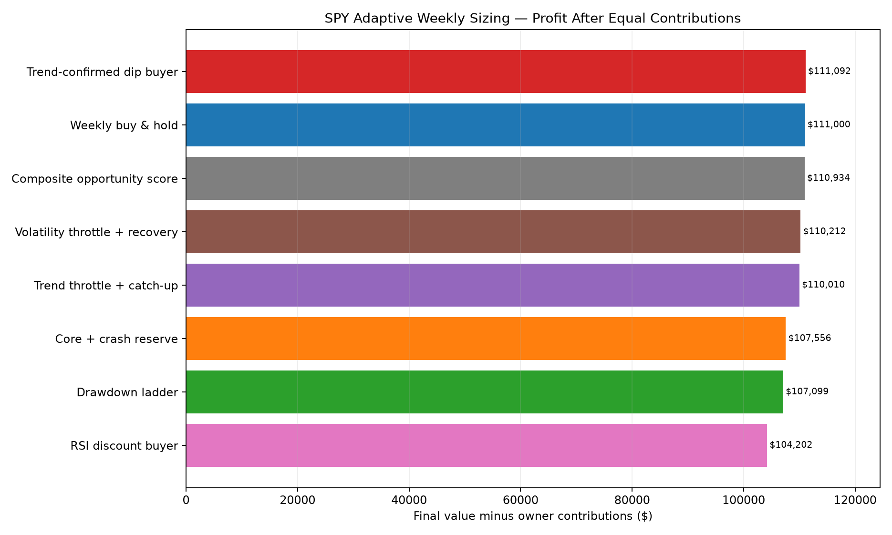
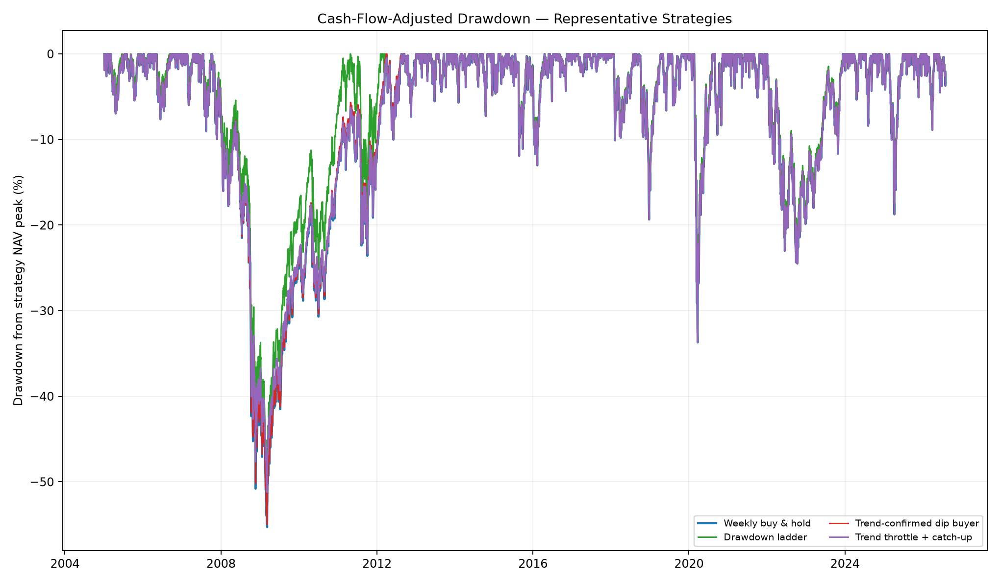
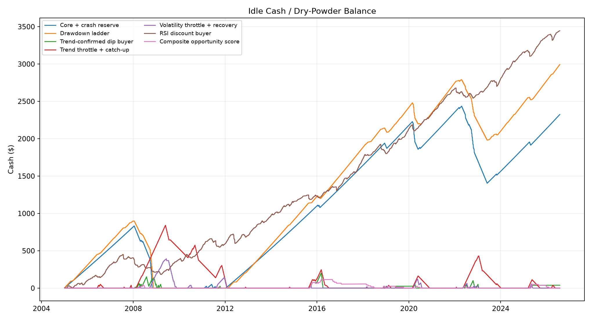

# SPY Adaptive Weekly Trade-Size Study

Study period: **2005-01-03 through 2026-07-30**  
Asset traded: **SPY only**  
Owner contribution: **$25 on the first trading day of every ISO week**  
Base cash yield: **3% annually**  
Execution: **previous completed close determines size; next weekly open fills the purchase**

## Bottom line

1 adaptive rules finished above weekly buy-and-hold. The best was **Trend-confirmed dip buyer**, ahead by **$92**. No adaptive rule beat the control in the 2022–2026 holdout.

The benchmark and every adaptive strategy received exactly **$28,150** of owner capital. Results therefore are not inflated by unequal contributions. This test does not establish a durable edge unless any winner also survives the subperiod and cash-yield checks below.

## Full-period results

| Rank | Strategy | Contributed | Final value | Profit | IRR | TWR CAGR | Max DD | Avg exposure | Avg cash |
|---:|---|---:|---:|---:|---:|---:|---:|---:|---:|
| 1 | Trend-confirmed dip buyer | $28,150 | $139,242 | $111,092 | 13.04% | 10.79% | -54.99% | 99.91% | $10 |
| 2 | Weekly buy & hold | $28,150 | $139,150 | $111,000 | 13.04% | 10.77% | -55.30% | 100.00% | $0 |
| 3 | Composite opportunity score | $28,150 | $139,084 | $110,934 | 13.03% | 10.77% | -55.27% | 99.96% | $11 |
| 4 | Volatility throttle + recovery | $28,150 | $138,362 | $110,212 | 12.99% | 10.71% | -54.31% | 99.70% | $15 |
| 5 | Trend throttle + catch-up | $28,150 | $138,160 | $110,010 | 12.98% | 10.75% | -51.22% | 98.59% | $97 |
| 6 | Core + crash reserve | $28,150 | $135,706 | $107,556 | 12.85% | 10.67% | -52.45% | 94.71% | $1,076 |
| 7 | Drawdown ladder | $28,150 | $135,249 | $107,099 | 12.82% | 10.69% | -51.75% | 93.92% | $1,280 |
| 8 | RSI discount buyer | $28,150 | $132,352 | $104,202 | 12.66% | 10.57% | -52.58% | 94.78% | $1,425 |

## Profit comparison



## Cash-flow-adjusted drawdown

Representative curves are shown to keep the heavily overlapping series readable: the control, the full-period leader, the best defensive trend rule and the drawdown ladder.



## Dry-powder balances



## Subperiod stability

Each subperiod starts with no shares and no reserve. Parameters were frozen before this run. The final 2022–2026 segment was reported separately and was not used to modify the rules afterward.

| Strategy | Development final | vs control | Validation final | vs control | Holdout final | vs control | Periods won |
|---|---:|---:|---:|---:|---:|---:|---:|
| Weekly buy & hold | $29,067 | $0 | $10,875 | $0 | $9,105 | $0 | 0/3 |
| Core + crash reserve | $29,091 | $24 | $10,585 | $-289 | $8,912 | $-193 | 1/3 |
| Drawdown ladder | $29,194 | $127 | $10,471 | $-403 | $8,927 | $-178 | 1/3 |
| Trend-confirmed dip buyer | $29,100 | $33 | $10,866 | $-9 | $9,086 | $-19 | 1/3 |
| Trend throttle + catch-up | $28,853 | $-214 | $10,821 | $-54 | $9,030 | $-75 | 0/3 |
| Volatility throttle + recovery | $28,880 | $-187 | $10,838 | $-37 | $9,098 | $-7 | 0/3 |
| RSI discount buyer | $28,566 | $-501 | $10,366 | $-508 | $8,932 | $-173 | 0/3 |
| Composite opportunity score | $29,061 | $-7 | $10,873 | $-2 | $9,101 | $-4 | 0/3 |

## Cash-yield sensitivity

Only idle positive cash earns the tested yield. SPY holdings and owner contributions are unchanged.

| Strategy | 0% cash yield | 3% cash yield | 5% cash yield |
|---|---:|---:|---:|
| Weekly buy & hold | $139,150 | $139,150 | $139,150 |
| Core + crash reserve | $134,455 | $135,706 | $136,690 |
| Drawdown ladder | $133,788 | $135,249 | $136,451 |
| Trend-confirmed dip buyer | $139,208 | $139,242 | $139,266 |
| Trend throttle + catch-up | $137,777 | $138,160 | $138,433 |
| Volatility throttle + recovery | $138,283 | $138,362 | $138,417 |
| RSI discount buyer | $131,432 | $132,352 | $133,219 |
| Composite opportunity score | $139,063 | $139,084 | $139,099 |

## Rules tested

### Weekly buy & hold

Invest the full $25 every week. This is the control.

### Core plus crash reserve

- Drawdown under 10%: invest $20 (0.8×), retaining $5.
- Drawdown 10–20%: request $40 (1.6×).
- Drawdown 20–30%: request $75 (3×).
- Drawdown over 30%: request $125 (5×).

### Drawdown ladder

- Within 5% of the closing high: 0.75×.
- Drawdown 5–10%: 1×.
- Drawdown 10–20%: 1.5×.
- Drawdown 20–30%: 2.5×.
- Drawdown over 30%: 4×.

### Trend-confirmed dip buyer

- Below a falling SMA200: 0.5×.
- Normal trend: 1×.
- Drawdown over 10% and above SMA20: 2×.
- Drawdown over 20% and above SMA50: 3×.
- After crossing above SMA200: request 3× for four weekly purchases.

### Trend throttle and catch-up

- Above a rising SMA200: 1.25×.
- Above a non-rising SMA200: 1×.
- Below SMA200: 0.5×.
- After crossing above SMA200: request 2× for eight weekly purchases.

### Volatility throttle and recovery

- 20-day annualized volatility under 15%: 1.25×.
- 15–25%: 1×.
- 25–35%: 0.75×.
- Over 35%: 0.5×.
- Once volatility is below 25% and SPY is above SMA20: request 2×.

### RSI discount buyer

- RSI above 70: 0.5×; 55–70: 0.75×; 40–55: 1×; 30–40: 1.5×; below 30: 3×.
- Purchases are capped at 1.5× below a falling SMA200.

### Composite opportunity score

Starts at 1×, subtracts size for a falling SMA200 and volatility over 30%, and adds size for 10%/20% drawdowns, RSI below 35 and SMA20 recovery. Requested size is clamped to 0.25×–3×.

All amounts above are requests. Actual purchases cannot exceed accumulated cash, so no strategy borrows or spends future contributions.

## No-look-ahead controls

1. Signals use only data through the trading session immediately preceding the weekly purchase.
2. Trades fill at the next weekly opening price with 5 basis points of adverse execution cost.
3. Monday holidays automatically move the purchase to the first available trading session.
4. Rolling highs, moving averages, RSI and volatility use backward-looking windows only.
5. No weekly low, future close or future contribution is available to a sizing decision.
6. The transaction log records both `signal_date` and `trade_date` for auditing.

## Interpretation and limitations

- This is one U.S. equity ETF history. It contains the 2008 and 2020 crashes, which can dominate reserve-strategy results.
- Holding cash has an opportunity cost. A result that wins only with a high cash yield is not a SPY timing edge.
- Adjusted Yahoo Finance bars incorporate distributions, but taxes and broker-specific cash rates are excluded.
- Five basis points is charged on every purchase. There are no sales, leverage, options or short positions.
- Thresholds were specified before this run, but examining these results consumes the historical sample. Future changes require a new holdout or walk-forward procedure.
- The fair primary benchmark is **$25 weekly SPY buy-and-hold**, not a $28,150 lump sum invested in 2005. Those are different cash-flow problems.

## Files and reproduction

- `spy_adaptive_weekly_results.csv`: full-period results.
- `spy_adaptive_weekly_subperiods.csv`: development, validation and holdout results.
- `spy_adaptive_weekly_cash_sensitivity.csv`: 0%, 3% and 5% cash-yield runs.
- `spy_adaptive_weekly_decisions.csv`: complete causal transaction-decision audit.

```powershell
.\.venv\Scripts\python.exe studies\run_spy_adaptive_weekly_study.py
```
