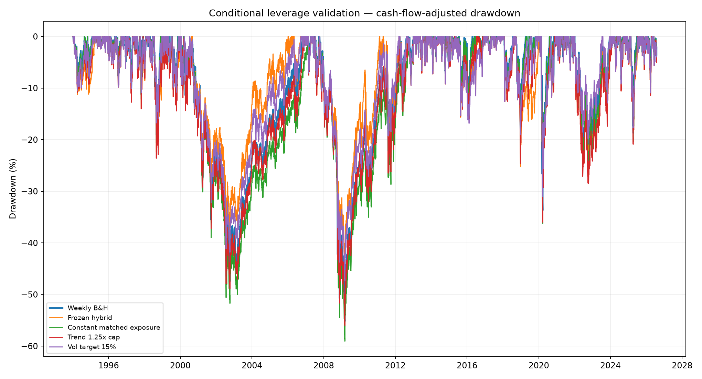
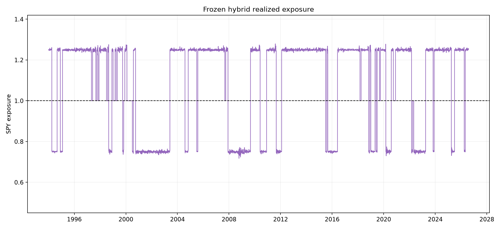
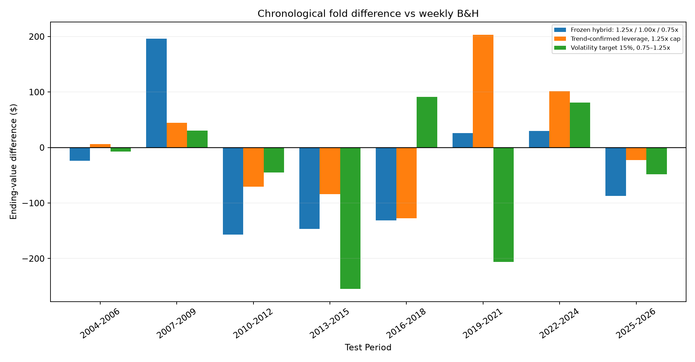
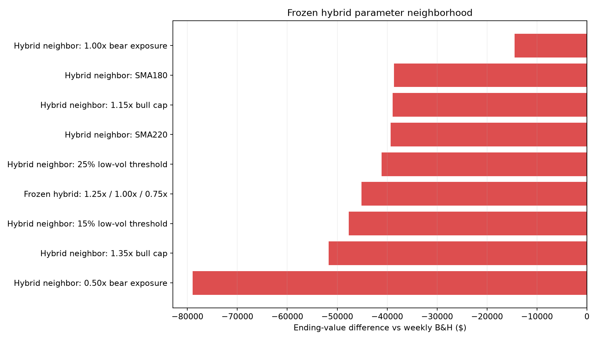

# SPY Conditional-Leverage Edge Validation

Study period: **1994-01-03 through 2026-07-30**  
SPY data available: **1993-01-29 through 2026-07-30**  
Contribution: **$25 on the first trading day of every ISO week**  
Execution: **month-end signal, next session's open, 3% rebalance band**  
Base financing: **10% annual margin rate, 3% positive cash yield, 5 bps per trade side**

## Verdict

**REJECTED AS A PROVEN EDGE — 2/14 predeclared validation gates passed.**

The frozen hybrid finished at **$297,613**, versus **$342,730** for weekly B&H and **$334,597** for constant **1.09x** exposure. Its maximum drawdown was **-45.57%**, and it generated **0** margin calls.

The constant-exposure comparison is essential. If the conditional rule cannot beat an untimed portfolio carrying the same average exposure, its apparent improvement comes from leverage rather than timing skill.

## Frozen primary rule

At every month-end, use only completed SPY data and change exposure at the next session's open:

- **1.25x** when close is above SMA200, SMA200 is above its value 20 sessions earlier, six-month return is positive, and 20-day annualized volatility is below 20%.
- **1.00x** when the trend conditions are bullish but volatility is at least 20%.
- **0.75x** otherwise.
- Exposure is implemented through SPY margin, not a daily-reset leveraged ETF.

## Full-history results

| Strategy | Contributed | Final value | vs B&H | IRR | Max DD | Avg exposure | Financing | Margin calls |
|---|---:|---:|---:|---:|---:|---:|---:|---:|
| Weekly SPY buy & hold | $42,500 | $342,730 | $0 | 10.75% | -55.21% | 100.00% | $0 | 0 |
| Constant matched exposure | $42,500 | $334,597 | $-8,133 | 10.64% | -59.07% | 108.74% | $19,520 | 0 |
| Trend-confirmed leverage, 1.15x cap | $42,500 | $334,253 | $-8,477 | 10.63% | -55.70% | 110.48% | $26,022 | 0 |
| Constant 1.15x exposure | $42,500 | $327,303 | $-15,427 | 10.53% | -61.78% | 115.00% | $32,513 | 0 |
| Trend-confirmed leverage, 1.25x cap | $42,500 | $326,726 | $-16,004 | 10.53% | -56.03% | 117.46% | $42,990 | 0 |
| Volatility target 18%, 0.75–1.25x | $42,500 | $320,512 | $-22,218 | 10.44% | -50.40% | 111.40% | $38,302 | 0 |
| Trend-confirmed leverage, 1.35x cap | $42,500 | $318,969 | $-23,761 | 10.42% | -56.36% | 124.45% | $59,632 | 0 |
| Constant 1.25x exposure | $42,500 | $313,821 | $-28,909 | 10.34% | -67.32% | 125.00% | $51,419 | 0 |
| Volatility target 15%, 0.75–1.25x | $42,500 | $303,787 | $-38,943 | 10.19% | -47.38% | 105.12% | $30,021 | 0 |
| Constant 1.35x exposure | $42,500 | $301,774 | $-40,956 | 10.16% | -72.92% | 134.99% | $68,458 | 0 |
| Frozen hybrid: 1.25x / 1.00x / 0.75x | $42,500 | $297,613 | $-45,117 | 10.09% | -45.57% | 108.74% | $40,636 | 0 |
| Volatility target 12%, 0.75–1.25x | $42,500 | $280,717 | $-62,013 | 9.82% | -44.89% | 96.79% | $19,071 | 0 |





## Earlier-period evidence

The 1994–2004 segment predates the original 2005–2026 studies, although it was consumed by the preceding hedge validation and is no longer untouched.

| Strategy | Contributed | Final value | vs B&H | IRR | Max DD | Avg exposure | Financing | Margin calls |
|---|---:|---:|---:|---:|---:|---:|---:|---:|
| Frozen hybrid: 1.25x / 1.00x / 0.75x | $14,350 | $23,995 | $1,608 | 9.05% | -38.53% | 104.87% | $1,497 | 0 |
| Trend-confirmed leverage, 1.25x cap | $14,350 | $23,161 | $774 | 8.44% | -48.89% | 116.14% | $1,884 | 0 |
| Weekly SPY buy & hold | $14,350 | $22,387 | $0 | 7.86% | -47.52% | 100.00% | $0 | 0 |
| Volatility target 15%, 0.75–1.25x | $14,350 | $22,346 | $-40 | 7.82% | -41.82% | 100.63% | $951 | 0 |

## Walk-forward evidence

Fixed candidates were restarted and tested in forward-moving three-year segments. An anchored selector separately chose among the trend 1.25x, volatility-target 15%, and frozen hybrid rules using only prior years.

| Strategy | Folds won | Median difference | Sum of differences |
|---|---:|---:|---:|
| Frozen hybrid: 1.25x / 1.00x / 0.75x | 3/8 | $-55 | $-294 |
| Trend-confirmed leverage, 1.25x cap | 4/8 | $-8 | $52 |
| Volatility target 15%, 0.75–1.25x | 3/8 | $-26 | $-358 |

The frozen hybrid beat B&H in **3/8** folds. The anchored selector won **3/8** subsequent folds.



## Crisis dependence

Daily active log return versus B&H was attributed to the 2008 and 2020 windows and all remaining dates:

| Segment | Active log return | Share of total |
|---|---:|---:|
| 2008 financial crisis | 12.68% | -111.36% |
| 2020 COVID crash | -2.70% | 23.74% |
| All dates outside both windows | -21.36% | 187.62% |
| Total | -11.38% | 100.00% |

## Parameter neighborhood

The center was varied one input at a time: 1.15x/1.25x/1.35x bull caps, 15%/20%/25% low-volatility thresholds, 0.50x/0.75x/1.00x bear exposure, and SMA180/200/220. **0/9** points beat B&H and **0/9** beat constant matched exposure.



## Financing and execution stress

The frozen hybrid was rerun at 8%/10%/12% margin rates, 5/10/20 bps transaction costs, and 0%/3% cash yields. Each case was compared with B&H and constant matched exposure under the same assumptions.

- Stress cases beating both controls: **0/18**.
- Financing cost in the base frozen run: **$40,636**.
- Worst stress ending value: **$253,600**.
- Best stress ending value: **$321,144**.
- Margin calls across every stress run: **0**.

## Statistical checks and multiple testing

- Annualized mean active log return: **-0.35%**.
- Moving-block bootstrap 95% interval: **-1.77% to 1.07%**.
- Probability of a non-positive bootstrapped edge: **69.44%**.
- Annualized active Sharpe: **-0.08**.
- Deflated Sharpe probability after **557** known trials: **0.02%**.
- PBO across the three distinct conditional families: **80.09%** from **462** symmetric splits.

Known prior rows included in the multiple-testing penalty:

- `spy_directional_tp_all_configs.csv`: 156 rows
- `spy_temporary_hedge_overlays.csv`: 144 rows
- `spy_temporary_hedge_derisk.csv`: 144 rows
- `spy_short_decline_results.csv`: 8 rows
- `spy_adaptive_weekly_results.csv`: 8 rows
- `spy_timing_weekly_combined_results.csv`: 25 rows
- `spy_realistic_leverage_results.csv`: 53 rows

## Validation gates

- FAIL — Full history beats weekly B&H
- FAIL — Full history beats constant matched exposure
- PASS — Positive earlier 1994–2004 evidence
- FAIL — At least 70% of chronological folds beat B&H
- FAIL — At least 70% of anchored selections beat B&H
- FAIL — Positive active return outside 2008 and 2020
- FAIL — Bootstrap 95% interval above zero
- FAIL — Deflated Sharpe probability at least 95%
- FAIL — PBO below 20%
- FAIL — At least 70% of hybrid neighbors beat B&H
- FAIL — At least 70% of neighbors beat matched constant exposure
- FAIL — Maximum drawdown no worse than 40%
- PASS — No margin calls
- FAIL — At least 70% of stress cases beat both controls

## Limitations

1. The entire SPY history has now been inspected repeatedly. Walk-forward tests reduce leakage, but only a frozen forward log or a clearly labelled earlier index proxy can add genuinely untouched evidence.
2. Adjusted Yahoo OHLC bars include distributions in prices and can distort historical intraday levels. Raw OHLC plus separately credited dividends would be better for final execution work.
3. Financing is charged daily and stressed, but historical broker rates, changing house requirements, tax deductibility, and account-specific borrowing terms are not reconstructed.
4. The model checks open and intraday-low maintenance margin and forces liquidation, but daily bars cannot reproduce every intraday margin event or spread.
5. Taxes are excluded. Rebalancing a taxable account can realize gains, and margin-interest deductibility depends on the investor's circumstances.
6. Constant leverage and conditional leverage both add risk. Beating B&H through a higher average exposure is not alpha.
7. A single U.S. equity ETF supplies few independent bear and volatility regimes. Statistical precision is inherently limited.

## Decision

Do not live-trade conditional leverage as an established edge unless the verdict is **SUPPORTED**. A **PROMISING BUT UNCONFIRMED** result is suitable only for frozen paper trading. If the rule fails to beat constant matched exposure, retain B&H as the default because leverage—not timing—explains the extra wealth.

## Reproduction

- `spy_conditional_leverage_results.csv`
- `spy_conditional_leverage_early.csv`
- `spy_conditional_leverage_folds.csv`
- `spy_conditional_leverage_selected.csv`
- `spy_conditional_leverage_plateau.csv`
- `spy_conditional_leverage_crisis.csv`
- `spy_conditional_leverage_stress.csv`

```powershell
.\.venv\Scripts\python.exe studies\run_spy_conditional_leverage_validation.py
```
