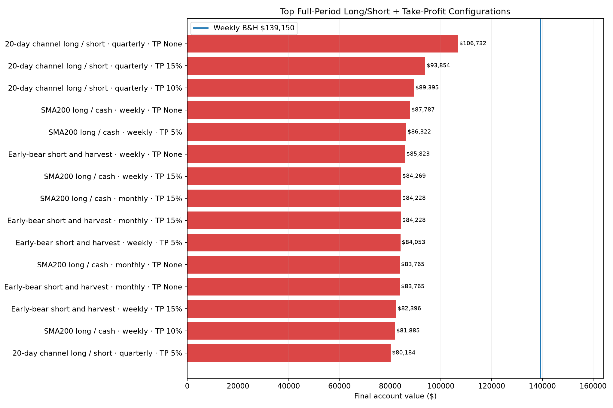
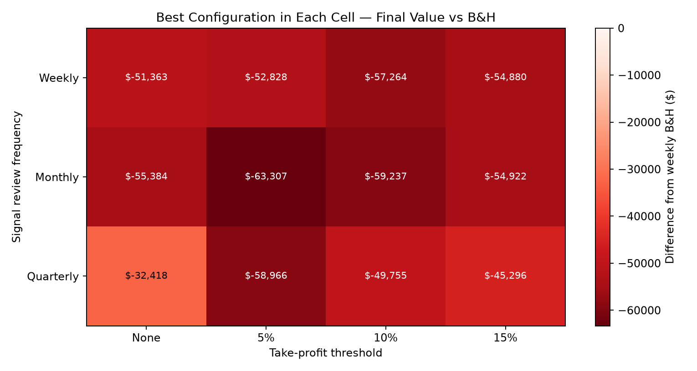
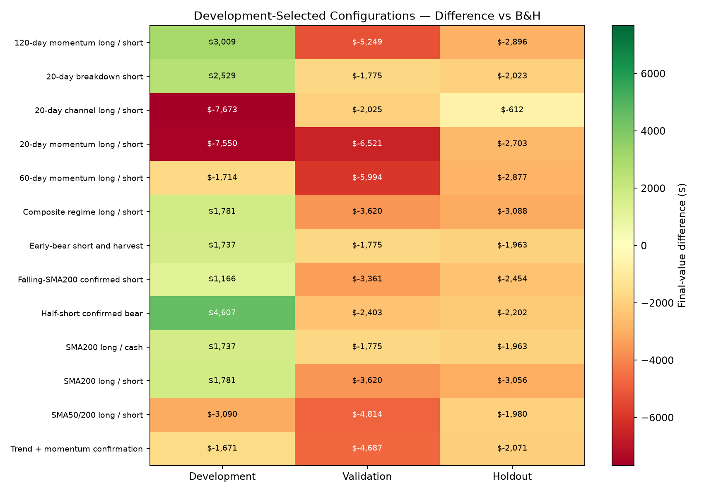
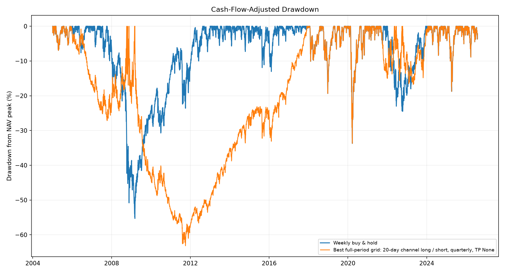

# SPY Bidirectional Timing and Take-Profit Study

Study period: **2005-01-03 through 2026-07-30**  
Asset: **SPY only**  
Owner contributions: **$25 every week for every configuration**  
Search: **13 signal families × 3 review schedules × 4 take-profit settings = 156 configurations**  
Base friction: **5 bps per trade, 1% annual short-borrow fee, 3% yield on eligible idle cash**

## Bottom line

None of the 156 configurations beat weekly B&H over the full history. The closest was **20-day channel long / short — quarterly review, TP None**, behind by **$32,418**. No development-selected signal family beat B&H in both the validation and holdout segments.

Every full-period account received exactly **$28,150**, matching weekly B&H's **$139,150** final value. The development-selected test is the more credible result because it prevents validation and holdout data from choosing each signal family's frequency or take-profit threshold.

Across the rerun of the older controls, only the original weekly **Trend-confirmed dip buyer** finished above B&H, by approximately **$92**. As documented in the earlier adaptive study, that tiny advantage did not survive the 2022–2026 holdout and is not evidence of a durable edge.

## What “weekly, monthly or quarterly” means

Contributions remain $25 every week. The timeframe controls how often the model may choose long, short or cash:

- **Weekly:** reconsider on the first trading session of each ISO week.
- **Monthly:** reconsider on the first trading session of each month.
- **Quarterly:** reconsider on the first trading session of each calendar quarter.

Each decision uses the immediately preceding completed close and trades at the current open. A take-profit can close the position between decisions; after that, the account stays in cash until its next scheduled review.

## Best full-period configurations

| Rank | Strategy | Review | Take profit | Final value | vs B&H | IRR | TWR CAGR | Max DD | Days short | TP exits |
|---:|---|---|---:|---:|---:|---:|---:|---:|---:|---:|
| 1 | 20-day channel long / short | Quarterly | None | $106,732 | $-32,418 | 11.03% | 7.12% | -63.16% | 32.45% | 0 |
| 2 | 20-day channel long / short | Quarterly | 15% | $93,854 | $-45,296 | 10.04% | 6.60% | -56.79% | 30.92% | 14 |
| 3 | 20-day channel long / short | Quarterly | 10% | $89,395 | $-49,755 | 9.67% | 6.05% | -56.79% | 29.70% | 22 |
| 4 | SMA200 long / cash | Weekly | None | $87,787 | $-51,363 | 9.53% | 8.22% | -20.87% | 0.00% | 0 |
| 5 | SMA200 long / cash | Weekly | 5% | $86,322 | $-52,828 | 9.39% | 7.93% | -22.27% | 0.00% | 63 |
| 6 | Early-bear short and harvest | Weekly | None | $85,823 | $-53,326 | 9.35% | 8.27% | -20.87% | 0.79% | 0 |
| 7 | SMA200 long / cash | Weekly | 15% | $84,269 | $-54,880 | 9.21% | 7.99% | -21.17% | 0.00% | 17 |
| 8 | Early-bear short and harvest | Monthly | 15% | $84,228 | $-54,922 | 9.20% | 9.35% | -24.15% | 0.00% | 17 |
| 9 | SMA200 long / cash | Monthly | 15% | $84,228 | $-54,922 | 9.20% | 9.35% | -24.15% | 0.00% | 17 |
| 10 | Early-bear short and harvest | Weekly | 5% | $84,053 | $-55,097 | 9.19% | 7.90% | -22.27% | 0.76% | 64 |
| 11 | SMA200 long / cash | Monthly | None | $83,765 | $-55,384 | 9.16% | 9.24% | -24.15% | 0.00% | 0 |
| 12 | Early-bear short and harvest | Monthly | None | $83,765 | $-55,384 | 9.16% | 9.24% | -24.15% | 0.00% | 0 |
| 13 | Early-bear short and harvest | Weekly | 15% | $82,396 | $-56,753 | 9.03% | 8.03% | -21.17% | 0.79% | 17 |
| 14 | SMA200 long / cash | Weekly | 10% | $81,885 | $-57,264 | 8.98% | 7.72% | -22.17% | 0.00% | 27 |
| 15 | 20-day channel long / short | Quarterly | 5% | $80,184 | $-58,966 | 8.82% | 4.97% | -57.09% | 26.79% | 41 |



## Frequency and take-profit comparison

Each cell summarizes all 13 signal families.

| Review frequency | Take profit | Best final value | Best vs B&H | Median final value | Configurations beating B&H |
|---|---:|---:|---:|---:|---:|
| Monthly | None | $83,765 | $-55,384 | $49,313 | 0/13 |
| Monthly | 5% | $75,843 | $-63,307 | $46,705 | 0/13 |
| Monthly | 10% | $79,913 | $-59,237 | $48,813 | 0/13 |
| Monthly | 15% | $84,228 | $-54,922 | $47,806 | 0/13 |
| Quarterly | None | $106,732 | $-32,418 | $42,610 | 0/13 |
| Quarterly | 5% | $80,184 | $-58,966 | $34,039 | 0/13 |
| Quarterly | 10% | $89,395 | $-49,755 | $42,506 | 0/13 |
| Quarterly | 15% | $93,854 | $-45,296 | $43,637 | 0/13 |
| Weekly | None | $87,787 | $-51,363 | $46,356 | 0/13 |
| Weekly | 5% | $86,322 | $-52,828 | $45,129 | 0/13 |
| Weekly | 10% | $81,885 | $-57,264 | $46,124 | 0/13 |
| Weekly | 15% | $84,269 | $-54,880 | $45,060 | 0/13 |



## Development selection followed by out-of-sample evaluation

For each signal family, the frequency and take-profit setting with the highest 2005–2016 final value was frozen. Only those frozen choices were then run on 2017–2021 and 2022–2026.

| Signal family | Development-selected configuration | Development vs B&H | Validation vs B&H | Holdout vs B&H | Validation + holdout won |
|---|---|---:|---:|---:|---:|
| SMA200 long / cash | Monthly, TP 5% | $1,737 | $-1,775 | $-1,963 | No |
| SMA200 long / short | Monthly, TP 5% | $1,781 | $-3,620 | $-3,056 | No |
| Falling-SMA200 confirmed short | Monthly, TP 5% | $1,166 | $-3,361 | $-2,454 | No |
| Half-short confirmed bear | Monthly, TP 5% | $4,607 | $-2,403 | $-2,202 | No |
| SMA50/200 long / short | Monthly, TP 5% | $-3,090 | $-4,814 | $-1,980 | No |
| 20-day breakdown short | Monthly, TP 5% | $2,529 | $-1,775 | $-2,023 | No |
| Early-bear short and harvest | Monthly, TP 5% | $1,737 | $-1,775 | $-1,963 | No |
| 20-day momentum long / short | Quarterly, TP 5% | $-7,550 | $-6,521 | $-2,703 | No |
| 60-day momentum long / short | Quarterly, TP 10% | $-1,714 | $-5,994 | $-2,877 | No |
| 120-day momentum long / short | Monthly, TP 5% | $3,009 | $-5,249 | $-2,896 | No |
| Trend + momentum confirmation | Quarterly, TP 15% | $-1,671 | $-4,687 | $-2,071 | No |
| 20-day channel long / short | Quarterly, TP None | $-7,673 | $-2,025 | $-612 | No |
| Composite regime long / short | Monthly, TP 5% | $1,781 | $-3,620 | $-3,088 | No |



## Drawdown of the full-period leader



## Previous-study controls rerun

The adaptive rules remain long-only sizing strategies because converting a sizing rule into a short signal would silently change its definition. Each adaptive rule was rerun with weekly, monthly and quarterly size reviews. The original short-study rules were also rerun with their original daily decision process and no take-profit. All use the same contribution and cost assumptions.

| Study family | Strategy | Final value | vs B&H | IRR | Max DD |
|---|---|---:|---:|---:|---:|
| Adaptive sizing (weekly) | Trend-confirmed dip buyer | $139,242 | $92 | 13.04% | -54.99% |
| Adaptive sizing (weekly) | Weekly buy & hold | $139,150 | $-0 | 13.04% | -55.30% |
| Adaptive sizing (quarterly) | Weekly buy & hold | $139,150 | $-0 | 13.04% | -55.30% |
| Adaptive sizing (monthly) | Weekly buy & hold | $139,150 | $-0 | 13.04% | -55.30% |
| Prior short study | Weekly buy & hold | $139,150 | $-0 | 13.04% | -55.30% |
| Adaptive sizing (monthly) | Composite opportunity score | $139,099 | $-50 | 13.03% | -55.23% |
| Adaptive sizing (weekly) | Composite opportunity score | $139,084 | $-66 | 13.03% | -55.27% |
| Adaptive sizing (quarterly) | Composite opportunity score | $139,041 | $-108 | 13.03% | -55.30% |
| Adaptive sizing (monthly) | Trend-confirmed dip buyer | $138,790 | $-360 | 13.02% | -55.15% |
| Adaptive sizing (weekly) | Volatility throttle + recovery | $138,362 | $-787 | 12.99% | -54.31% |
| Adaptive sizing (monthly) | Volatility throttle + recovery | $138,295 | $-854 | 12.99% | -54.45% |
| Adaptive sizing (quarterly) | Volatility throttle + recovery | $138,271 | $-879 | 12.99% | -53.86% |
| Adaptive sizing (weekly) | Trend throttle + catch-up | $138,160 | $-989 | 12.98% | -51.22% |
| Adaptive sizing (quarterly) | Trend-confirmed dip buyer | $138,113 | $-1,036 | 12.98% | -54.48% |
| Adaptive sizing (monthly) | Trend throttle + catch-up | $138,090 | $-1,059 | 12.98% | -53.54% |
| Adaptive sizing (quarterly) | Core + crash reserve | $137,395 | $-1,755 | 12.94% | -51.68% |
| Adaptive sizing (quarterly) | Drawdown ladder | $136,659 | $-2,491 | 12.90% | -50.28% |
| Adaptive sizing (quarterly) | Trend throttle + catch-up | $135,990 | $-3,159 | 12.86% | -50.47% |
| Adaptive sizing (monthly) | Core + crash reserve | $135,721 | $-3,428 | 12.85% | -52.21% |
| Adaptive sizing (weekly) | Core + crash reserve | $135,706 | $-3,444 | 12.85% | -52.45% |
| Adaptive sizing (monthly) | Drawdown ladder | $135,687 | $-3,463 | 12.85% | -50.94% |
| Adaptive sizing (weekly) | Drawdown ladder | $135,249 | $-3,900 | 12.82% | -51.75% |
| Adaptive sizing (weekly) | RSI discount buyer | $132,352 | $-6,798 | 12.66% | -52.58% |
| Adaptive sizing (monthly) | RSI discount buyer | $130,609 | $-8,540 | 12.56% | -50.74% |
| Adaptive sizing (quarterly) | RSI discount buyer | $130,003 | $-9,146 | 12.53% | -50.52% |
| Prior short study | SMA200 long / cash | $88,796 | $-50,354 | 9.61% | -24.10% |
| Prior short study | Early-bear short and harvest | $83,891 | $-55,259 | 9.17% | -24.10% |
| Prior short study | Half-short confirmed bear | $74,379 | $-64,771 | 8.23% | -26.20% |
| Prior short study | 20-day breakdown short | $63,805 | $-75,345 | 7.01% | -32.62% |
| Prior short study | Falling-SMA200 confirmed short | $46,199 | $-92,951 | 4.36% | -41.54% |
| Prior short study | SMA50/200 long / short | $43,235 | $-95,914 | 3.80% | -44.50% |
| Prior short study | SMA200 long / short | $40,917 | $-98,232 | 3.33% | -48.08% |

## Signal families swept

### Previous short-study families

- SMA200 long/cash defensive control.
- SMA200 long/short.
- Below-a-falling-SMA200 confirmed short.
- Half-size confirmed bear short.
- SMA50/SMA200 long/short.
- Prior-20-day-low breakdown short, covering above SMA20.
- Early-bear breakdown short, harvesting at a 15% drawdown, RSI below 30, or SMA20 recovery.

### Added bidirectional families

- 20-, 60- and 120-day momentum: long for positive trailing return, short for negative.
- Trend plus momentum: long only above SMA200 with positive 60-day momentum; short only below a falling SMA200 with negative momentum; otherwise cash.
- 20-day channel: switch long on a prior-20-day-high breakout and short on a prior-20-day-low breakdown.
- Composite regime: vote using price versus SMA200, SMA200 slope, 20/60-day momentum and SMA50 versus SMA200; long or short only with a sufficiently strong vote.

## Take-profit mechanics

- Thresholds tested: none, 5%, 10% and 15% from the position's weighted entry price.
- Long targets trigger from the daily adjusted high; short targets trigger from the daily adjusted low.
- The exit is modeled at the resting target price, including an exit transaction cost.
- If both a short maintenance breach and short take-profit could occur within one daily bar, the adverse margin check is processed first because intraday ordering is unknown.

## No-look-ahead and realism controls

1. Signals are computed only from completed closing data and shifted to the next open.
2. Stateful breakout signals update only on scheduled review dates, not on skipped dates.
3. Short-sale proceeds cannot increase permitted exposure or earn cash interest.
4. Exposure is capped at +1× long or -1× short.
5. Adjusted SPY returns include distributions, so short exposure bears the opposite total return and implicitly pays the dividend liability.
6. Short notional pays a 1% annual borrow fee; every entry, exit, flip and rebalance pays 5 bps.
7. Shorts face a 30% maintenance test at the open and intraday high, with forced covering and a 20-session lockout.
8. All full-period configurations receive the exact same owner contributions.

## Interpretation limits

- The full-period ranking is in-sample and searches 156 related configurations. Its leader is not automatically an edge.
- The development/validation/holdout table is the primary robustness check, although all periods still come from one SPY history.
- Exact intraday target fills are an approximation. Real stop/limit behavior, spreads and taxes may be worse.
- Monthly and quarterly decisions reduce signal turnover but can react late to fast crashes and rebounds.
- A take-profit limits participation in extended trends and can leave cash idle while SPY continues rising.
- Direct shorting has asymmetric loss risk and broker-specific requirements even at the modeled 1× exposure cap.

## Output files

- `spy_directional_tp_all_configs.csv`: all full-period configurations.
- `spy_directional_tp_development.csv`: complete development search.
- `spy_directional_tp_selected_oos.csv`: frozen validation and holdout evaluations.
- `spy_directional_tp_legacy_controls.csv`: rerun adaptive and prior-short controls.
- `spy_directional_tp_best_trades.csv`: execution audit for the full-period leader.

```powershell
.\.venv\Scripts\python.exe studies\run_spy_directional_take_profit_study.py
```
