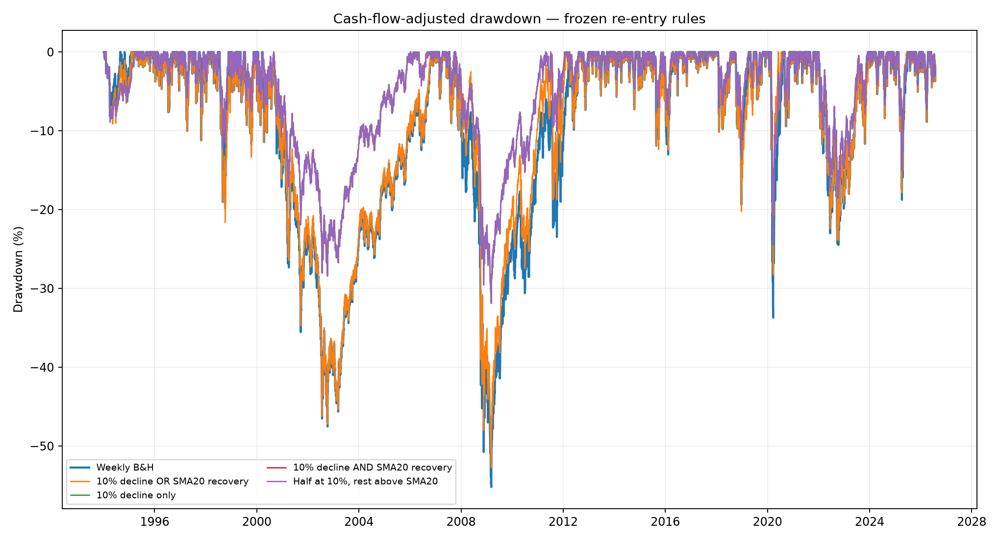
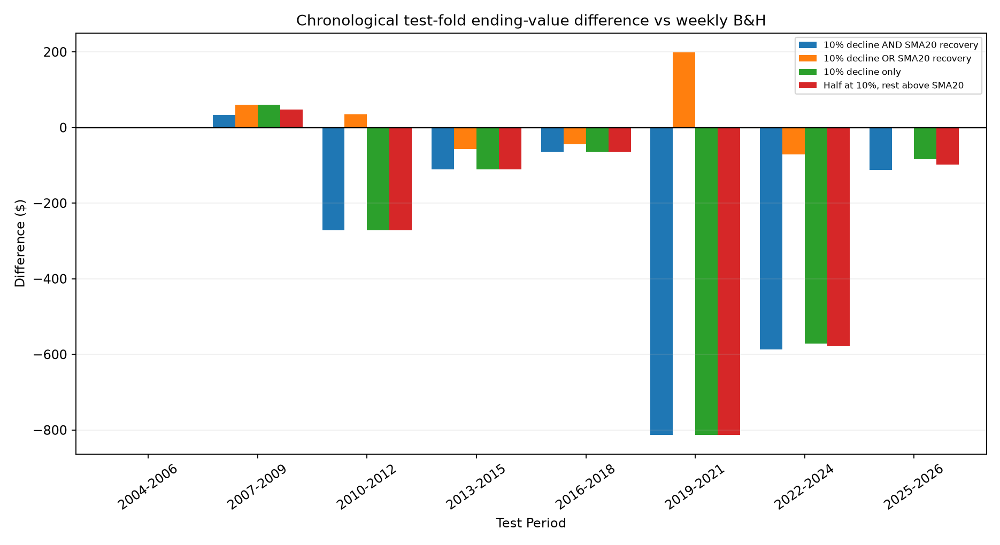
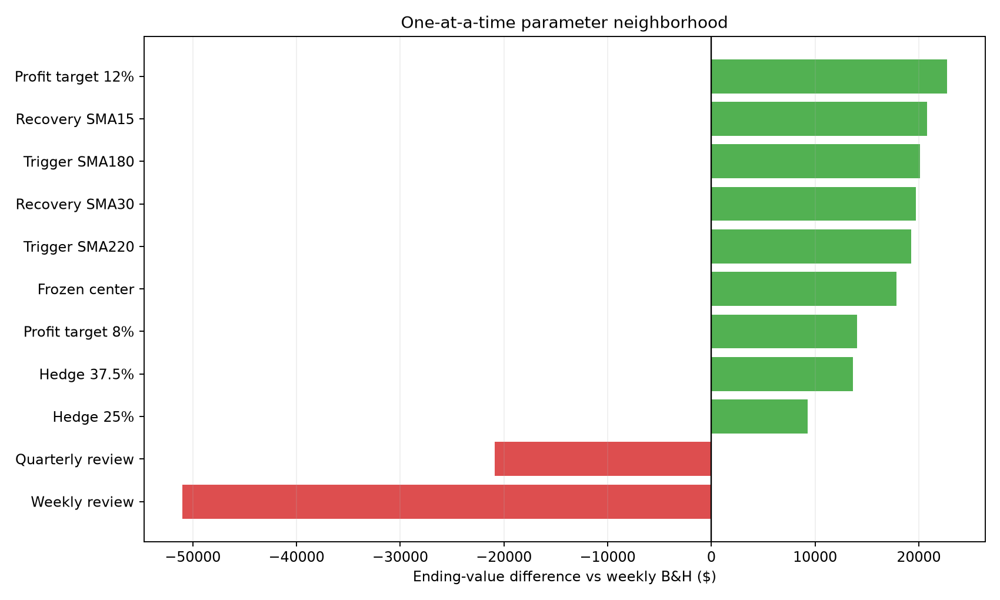

# SPY Hedge Edge Validation

Run through: **2026-07-30**  
Available adjusted-bar history: **1993-01-29 through 2026-07-30**  
Primary confirmation period: **1994-01-03 through 2026-07-30**  
Owner contribution: **$25 on the first trading day of every ISO week**  
Data source: **extended adjusted Yahoo Finance bars**

## Verdict

**REJECTED AS A PROVEN EDGE — 2/10 predeclared validation gates passed.**

The frozen partial-sale rule finished **$17,848** above weekly buy-and-hold over 1994–2026, but a full-sample lead is not sufficient evidence. Its earlier 1994–2004 result was **$-778** versus B&H, it won **4/8** fixed chronological folds, and the bootstrap 95% interval for annualized active return was **-0.65% to 0.84%**.

The matched explicit-short version finished **$-3,416** relative to partial sale. It should not be preferred unless it wins after borrow, execution, dividend and margin frictions.

Every row received the same amount on the same weekly schedule, so the dollar lead is not caused by extra contributions. Final dollars and unitized active return can still tell different stories because returns earned early and late interact differently with a growing contribution balance. The report therefore requires both wealth and return-based tests rather than treating the largest ending account as proof by itself.

## Frozen rules

All strategies receive identical contributions. The portfolio normally holds 100% SPY. On the first trading session of each month, the prior completed close is inspected. If it is below SMA200 and the trigger is armed, exposure is reduced to 50% at that session's open. After an exit, the trigger must clear before another activation.

The four re-entry rules were declared before this validation run:

1. Return to 100% after a 10% decline from activation **or** a prior close above SMA20.
2. Return after the 10% decline only.
3. Require the 10% decline and then an SMA20 recovery.
4. Restore half at the 10% decline and the remainder above SMA20.

## Full-history comparison

| Rule | Implementation | Contributed | Final value | vs B&H | IRR | Max DD | Entries |
|---|---|---|---|---|---|---|---|
| Weekly buy & hold | benchmark | 42500.0 | $342,730 | $0 | 10.75% | -55.21% | 0 |
| 10% decline OR SMA20 recovery | derisk_cash | 42500.0 | $360,578 | $17,848 | 10.98% | -52.71% | 21 |
| 10% decline only | derisk_cash | 42500.0 | $207,358 | $-135,372 | 8.39% | -31.90% | 1 |
| 10% decline AND SMA20 recovery | derisk_cash | 42500.0 | $207,358 | $-135,372 | 8.39% | -31.90% | 1 |
| Half at 10%, rest above SMA20 | derisk_cash | 42500.0 | $207,358 | $-135,372 | 8.39% | -31.90% | 1 |
| 10% decline OR SMA20 recovery | short_overlay | 42500.0 | $357,163 | $14,433 | 10.94% | -52.75% | 21 |
| 10% decline only | short_overlay | 42500.0 | $180,962 | $-161,768 | 7.74% | -38.24% | 1 |
| 10% decline AND SMA20 recovery | short_overlay | 42500.0 | $180,962 | $-161,768 | 7.74% | -38.24% | 1 |
| Half at 10%, rest above SMA20 | short_overlay | 42500.0 | $180,962 | $-161,768 | 7.74% | -38.24% | 1 |



## Earlier evidence: 1994–2004

This period predates the original 2005–2026 research sample. It is useful evidence, but inspecting it in this report consumes it as a future holdout.

| Rule | Implementation | Final value | vs B&H | Max DD |
|---|---|---|---|---|
| Weekly buy & hold | benchmark | $22,387 | $0 | -47.52% |
| 10% decline OR SMA20 recovery | derisk_cash | $21,608 | $-778 | -47.25% |
| 10% decline only | derisk_cash | $19,676 | $-2,711 | -28.43% |
| 10% decline AND SMA20 recovery | derisk_cash | $19,676 | $-2,711 | -28.43% |
| Half at 10%, rest above SMA20 | derisk_cash | $19,676 | $-2,711 | -28.43% |
| 10% decline OR SMA20 recovery | short_overlay | $21,557 | $-830 | -47.35% |
| 10% decline only | short_overlay | $17,733 | $-4,653 | -33.63% |
| 10% decline AND SMA20 recovery | short_overlay | $17,733 | $-4,653 | -33.63% |
| Half at 10%, rest above SMA20 | short_overlay | $17,733 | $-4,653 | -33.63% |

## Chronological walk-forward evidence

Each fixed rule was tested in non-overlapping, forward-moving three-year segments. Separately, an anchored procedure selected one of the four rules using only earlier years and then applied that choice to the next segment.

| Rule | Folds won | Win rate | Median fold difference | Sum of fold differences |
|---|---:|---:|---:|---:|
| 10% decline AND SMA20 recovery | 1/8 | 12.50% | $-111 | $-1,925 |
| 10% decline OR SMA20 recovery | 4/8 | 50.00% | $0 | $123 |
| 10% decline only | 1/8 | 12.50% | $-98 | $-1,855 |
| Half at 10%, rest above SMA20 | 1/8 | 12.50% | $-104 | $-1,889 |

The anchored selector won **4/8** subsequent test folds. Selecting among these four rules did not create a reliable edge unless that rate and the fixed-rule results both remained strong.



## Is the result only 2008 or 2020?

This attribution decomposes the strategy's daily active return versus B&H. It does not pretend that deleting dates creates a directly executable alternate history.

| Segment | Active log return | Share of total |
|---|---|---|
| 2008 financial crisis | 5.43% | 389.37% |
| 2020 COVID crash | 7.92% | 567.85% |
| All dates outside both windows | -11.96% | -857.22% |
| Total | 1.39% | 100.00% |

## Parameter plateau

One input at a time was moved around the frozen center: 25%/37.5%/50% de-risking, SMA180/200/220, SMA15/20/30 recovery, 8%/10%/12% decline targets, and weekly/monthly/quarterly reviews. **9/11** tested points beat B&H.



## Statistical checks and multiple testing

- Annualized mean active return: **0.04%**.
- Moving-block bootstrap 95% interval: **-0.65% to 0.84%**.
- One-sided bootstrap probability of a non-positive edge: **46.96%**.
- Annualized active Sharpe: **0.02**.
- Deflated Sharpe probability after **538** known prior rows: **0.15%**.
- Combinatorially symmetric cross-validation PBO across the four rules: **4.76%** from **462** splits.

PBO only asks whether selecting among these four re-entry rules was unstable. A low PBO does **not** show that the best member beats B&H; here it mainly says the OR rule consistently ranked above three structurally weak alternatives.

The trial count is deliberately conservative and includes overlapping report rows rather than pretending only the final four ideas were tried:

- `spy_directional_tp_all_configs.csv`: 156 rows
- `spy_temporary_hedge_overlays.csv`: 144 rows
- `spy_temporary_hedge_derisk.csv`: 144 rows
- `spy_short_decline_results.csv`: 8 rows
- `spy_adaptive_weekly_results.csv`: 8 rows
- `spy_timing_weekly_combined_results.csv`: 25 rows
- `spy_realistic_leverage_results.csv`: 53 rows

## Execution and financing stress

The base case charges 5 basis points per trade side, credits 3% on positive cash and charges the explicit short 1% annual borrow. Stress cases use 5–20 basis points, 0%/3% cash yield, and 1%/3%/6% short borrow.

- Best stress-case ending value: **$360,578** (derisk_cash).
- Worst stress-case ending value: **$344,118** (short_overlay).
- Stress rows beating the fixed weekly B&H base: **24/24**.

## Validation gates

- FAIL — Positive pre-2005 evidence
- FAIL — At least 70% fixed chronological folds won
- FAIL — At least 70% anchored selections won
- FAIL — Bootstrap 95% interval above zero
- FAIL — Deflated Sharpe probability at least 95%
- PASS — PBO below 20%
- PASS — At least 70% of neighbors beat B&H
- FAIL — No one crisis contributes over half of active return
- FAIL — At least 3-point drawdown improvement
- FAIL — Explicit short beats matched partial sale

These thresholds are research gates, not guarantees. A failed gate is a reason not to describe the result as established alpha.

## Important limitations that remain

1. Yahoo's adjusted OHLC bars are convenient for total-return testing but can distort historical intraday target touches. Raw prices plus separately credited dividends are preferable for final execution validation.
2. The 10% target assumes a conservative gap-through fill at the open but otherwise fills exactly at the adjusted daily low threshold. Intraday quotes, spreads and order queue effects are unavailable.
3. The cash yield is constant rather than historical T-bill or broker sweep rates.
4. Explicit-short borrow is stressed but historical locate availability, recalls, changing borrow fees, payments in lieu of dividends, and broker house margin changes are not fully reconstructed.
5. Taxes are excluded. Partial sales realize gains; explicit shorts add their own tax and distribution-payment complications. Taxable and retirement accounts can rank implementations differently.
6. The early history contains the same underlying U.S. equity market and is only about eleven years. It is new to this research process, not an independent universe.
7. The 2005–2026 history and the newly inspected 1994–2004 history are now consumed. Future confirmation must come from a frozen forward paper/live log or a clearly labelled pre-SPY proxy.
8. Statistical observations within a market path are dependent. Bootstrap, DSR and PBO reduce false confidence but cannot manufacture independent crash histories.

## Decision

Use weekly buy-and-hold as the live default unless the verdict above is **SUPPORTED** and a frozen forward test adds evidence. If partial sale passes while the explicit short does not beat it, the result is a **de-risking/timing hypothesis**, not a short-selling edge.

## Reproduction files

- `spy_hedge_validation_main.csv`
- `spy_hedge_validation_early.csv`
- `spy_hedge_validation_folds.csv`
- `spy_hedge_validation_anchored_selection.csv`
- `spy_hedge_validation_crisis.csv`
- `spy_hedge_validation_plateau.csv`
- `spy_hedge_validation_stress.csv`

```powershell
.\.venv\Scripts\python.exe studies\run_spy_hedge_edge_validation.py
```
