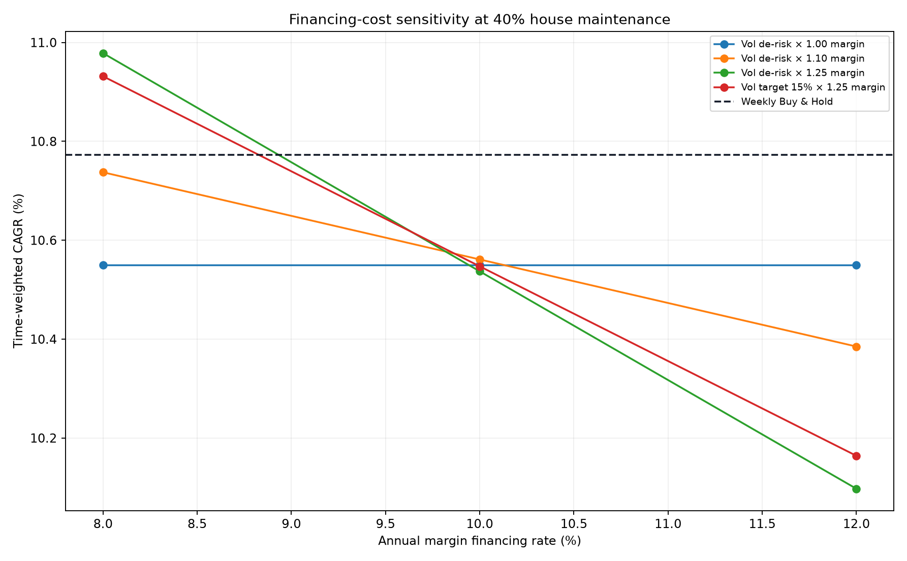
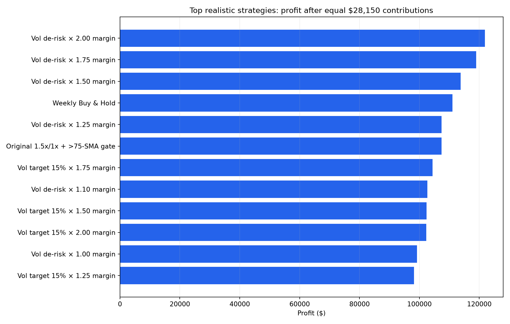
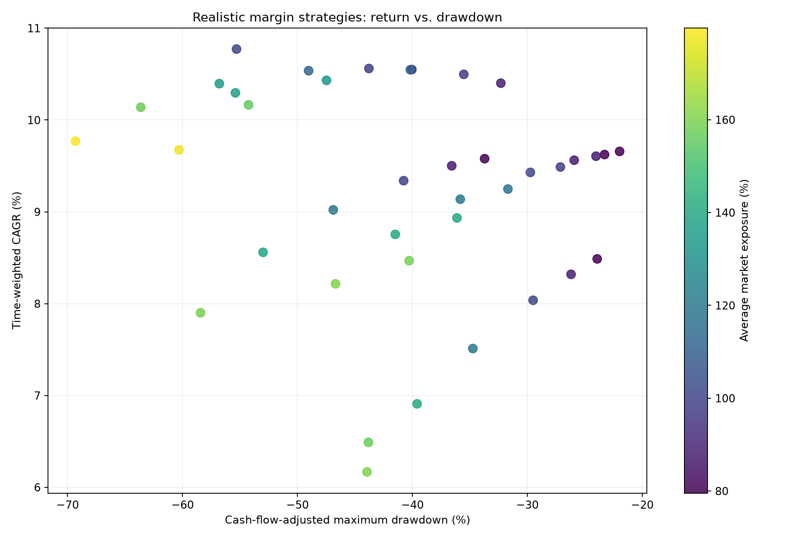

# SPY Realistic Leverage Retest

**Study period:** 2005-01-03 through 2026-07-30  
**Observations:** 5,427 adjusted daily OHLC bars  
**Owner contributions:** 1,126 weekly deposits × $25 = **$28,150 for every strategy**  
**Primary stress case:** 10% annual financing, 40% house maintenance, next-open execution, full forced liquidation, and a 20-trading-day lockout  
**Transaction cost:** 0.05% per trade side

## Executive Summary

The more realistic leverage assumptions reverse the earlier conclusion.

- **Weekly Buy & Hold won the conservative primary test:** $139,149.52 final value, 10.77% time-weighted CAGR, and -55.30% maximum drawdown.
- The original **1.5x/1x strategy fell to $135,500.97 and 10.30% time-weighted CAGR** at a 10% borrowing rate. Its -55.40% drawdown was effectively the same as Buy & Hold.
- The original **2x/cash strategy fell to $82,151.15 and 6.49% time-weighted CAGR**. Financing and delayed next-open regime changes erased its earlier apparent advantage.
- Adding leverage to lower-drawdown strategies did not produce a robust winner. The closest was **volatility de-risk ×1.10**, at 10.56% CAGR and -43.78% drawdown—slightly less return than Buy & Hold for materially less drawdown.
- **Volatility target ×1.25** returned 10.55% with a -40.18% drawdown. Additional leverage beyond that reduced return and deepened losses.
- No historical margin calls occurred in the primary OHLC path, but a synthetic 20% overnight gap while the 2x strategy was active triggered immediate liquidation. Its CAGR fell to 4.79% and drawdown worsened to -50.64%.
- Daily-reset leveraged ETF results were extremely sensitive to embedded financing. At a 10% financing proxy, every synthetic SSO/UPRO strategy underperformed Buy & Hold. At 5.5%, some versions outperformed, but with drawdowns reaching roughly -59% to -77% even when paired with volatility targeting.

## Corrected Verdict

There is no leverage strategy in this test that both:

1. Beats weekly Buy & Hold under the 10% financing case, and
2. Maintains a clearly safer drawdown profile.

The historical leverage advantage existed only under cheaper financing or much more optimistic execution. At an 8% borrowing rate, the original 1.5x/1x strategy beat Buy & Hold by approximately 0.39 percentage point annually, but retained essentially the same drawdown. At 10% and 12%, it lost to Buy & Hold.

## What Was Added to the Backtester

The conservative engine now includes:

- Prior-close signals executed at the next trading day's open.
- Daily interest on negative cash.
- 50% initial margin, limiting ordinary SPY margin exposure to 2x.
- Maintenance-margin scenarios of 25%, 30%, and 40%.
- Margin checks at both the adjusted daily open and adjusted intraday low.
- Full forced liquidation when maintenance is breached.
- A 20-trading-day lockout after liquidation.
- Actual historical adjusted opening gaps and daily lows.
- Additional synthetic 10%, 20%, and 30% overnight-gap scenarios.
- Daily-reset 2x and 3x ETF approximations.
- Leveraged ETF volatility decay through daily compounding.
- A 0.89% ETF expense ratio and 5.5%–12% embedded-financing sensitivity.
- Equal owner contributions, time-weighted return, and cash-flow-adjusted drawdown.

The regulatory framework follows the Federal Reserve's 50% Regulation T initial-margin requirement and FINRA's 25% maintenance minimum. FINRA notes that brokers commonly impose 30% or 40% house requirements and may liquidate positions without advance notice. [Federal Reserve Regulation T summary](https://www.federalreserve.gov/frrs/regulations/background-and-summary-of-regulation-t.htm), [FINRA margin-call guidance](https://www.finra.org/investors/insights/margin-calls).

## Primary Equal-Contribution Results

Every row below received exactly $28,150 of owner capital.

| Strategy | Final value | Profit | IRR | Time-weighted CAGR | Max drawdown | Avg. exposure | Margin calls |
|---|---:|---:|---:|---:|---:|---:|---:|
| Weekly Buy & Hold | $139,149.52 | $110,999.52 | 13.04% | **10.77%** | -55.30% | 100.0% | 0 |
| Vol de-risk ×1.10 | $130,801.45 | $102,651.45 | 12.57% | 10.56% | -43.78% | 98.9% | 0 |
| Vol de-risk ×1.00 | $127,342.77 | $99,192.77 | 12.37% | 10.55% | -40.05% | 89.9% | 0 |
| Vol target 15% ×1.25 | $126,317.56 | $98,167.56 | 12.31% | 10.55% | -40.18% | 111.0% | 0 |
| Vol de-risk ×1.25 | $135,528.97 | $107,378.97 | 12.84% | 10.54% | -49.03% | 112.4% | 0 |
| Vol target 15% ×1.10 | $121,960.28 | $93,810.28 | 12.04% | 10.50% | -35.53% | 97.7% | 0 |
| Vol target 15% ×1.00 | $118,195.37 | $90,045.37 | 11.81% | 10.40% | **-32.31%** | 88.8% | 0 |
| Original 1.5x/1x + 75-SMA deposit gate | $135,500.97 | $107,350.97 | 12.84% | 10.30% | -55.40% | 136.8% | 0 |
| MA 200d ±2% band ×1.00 | $100,772.32 | $72,622.32 | 10.59% | 9.66% | **-21.97%** | 79.6% | 0 |
| MA 200d ±2% band ×1.25 | $101,060.13 | $72,910.13 | 10.61% | 9.49% | -27.12% | 99.4% | 0 |
| Original 2x/cash + Friday 100-SMA gate | $82,151.15 | $54,001.15 | 9.02% | **6.49%** | -43.83% | 156.9% | 0 |

## Did More Leverage Improve the Lower-Drawdown Strategies?

Usually, no.

### Volatility target

| Exposure multiplier | Time-weighted CAGR | Max drawdown |
|---:|---:|---:|
| 1.00 | 10.40% | -32.31% |
| 1.10 | 10.50% | -35.53% |
| 1.25 | **10.55%** | -40.18% |
| 1.50 | 10.43% | -47.47% |
| 1.75 | 10.17% | -54.26% |
| 2.00 | 9.67% | -60.31% |

The historical optimum was near 1.25x, but it still returned less than Buy & Hold. Leverage above 1.25x made both return and drawdown worse.

### Volatility de-risk

| Exposure multiplier | Time-weighted CAGR | Max drawdown |
|---:|---:|---:|
| 1.00 | 10.55% | -40.05% |
| 1.10 | **10.56%** | -43.78% |
| 1.25 | 10.54% | -49.03% |
| 1.50 | 10.40% | -56.80% |
| 1.75 | 10.14% | -63.63% |
| 2.00 | 9.77% | -69.32% |

The 1.10x result added almost no return over the unleveraged version while increasing drawdown by approximately 3.73 percentage points.

### Moving-average band

| Exposure multiplier | Time-weighted CAGR | Max drawdown |
|---:|---:|---:|
| 1.00 | **9.66%** | -21.97% |
| 1.10 | 9.61% | -24.02% |
| 1.25 | 9.49% | -27.12% |
| 1.50 | 9.25% | -31.69% |
| 1.75 | 8.93% | -36.12% |
| 2.00 | 8.47% | -40.28% |

Every increase in leverage reduced return. The strategy did not earn enough during its invested periods to overcome financing and trading drag.

The 10-month MA, daily 200-day MA, and golden-cross families behaved similarly: their unleveraged versions produced the highest CAGR inside their respective families.

## Financing-Cost Sensitivity

### Original leveraged strategies at 40% house maintenance

| Strategy | Borrowing rate | Final value | Time-weighted CAGR | Max drawdown |
|---|---:|---:|---:|---:|
| Original 1.5x/1x | 8% | $152,166.96 | **11.16%** | -55.28% |
| Original 1.5x/1x | 10% | $135,500.97 | 10.30% | -55.40% |
| Original 1.5x/1x | 12% | $120,785.02 | 9.43% | -55.52% |
| Original 2x/cash | 8% | $101,738.88 | 8.17% | -43.66% |
| Original 2x/cash | 10% | $82,151.15 | 6.49% | -43.83% |
| Original 2x/cash | 12% | $66,894.04 | 4.84% | -44.97% |

The 1.5x/1x result crosses below Buy & Hold between approximately 8% and 10% financing. The 2x/cash version is not competitive even at 8%.

## Forced Liquidation and Gap Risk

No margin calls occurred on the actual historical adjusted daily opens and lows at 25%, 30%, or 40% maintenance. This does **not** mean the strategies were immune. It means no single observed daily move breached maintenance while the strategies were still leveraged.

The approximate instantaneous underlying decline required to breach maintenance is:

| Exposure | 25% maintenance | 30% maintenance | 40% maintenance |
|---:|---:|---:|---:|
| 1.10x | -87.88% | -87.01% | -84.85% |
| 1.25x | -73.33% | -71.43% | -66.67% |
| 1.50x | -55.56% | -52.38% | -44.44% |
| 1.75x | -42.86% | -38.78% | -28.57% |
| 2.00x | -33.33% | -28.57% | **-16.67%** |

These thresholds assume the account begins at exactly the stated exposure. Interest, trading costs, existing losses, broker rule changes, and concentrated-position requirements can reduce the cushion.

### Synthetic overnight gap while 200-day trend signal was bullish

The shock was inserted on 2020-02-20, with all subsequent prices scaled so later percentage returns remained intact.

| Strategy | Added gap | Final value | Time-weighted CAGR | Max drawdown | Forced liquidations |
|---|---:|---:|---:|---:|---:|
| Weekly Buy & Hold | -20% | $114,381.34 | 9.64% | -55.30% | 0 |
| Original 1.5x/1x | -20% | $103,243.67 | 8.72% | -55.40% | 0 |
| Original 2x/cash | -20% | $61,860.68 | 4.79% | -50.64% | **1** |
| Vol target ×1.25 | -20% | $110,752.89 | 9.79% | -40.18% | 0 |
| MA band ×1.25 | -20% | $88,293.22 | 8.70% | -29.20% | 0 |
| Original 1.5x/1x | -30% | $84,526.91 | 7.52% | -63.53% | 0 |
| Original 2x/cash | -30% | $45,814.33 | 2.84% | -67.10% | **1** |

FINRA states that a firm may sell enough securities to repay the entire margin loan and does not have to give advance notice or let the customer select what is sold. [FINRA margin-call guidance](https://www.finra.org/investors/insights/margin-calls).

## Daily-Reset Leveraged ETF Test

The synthetic ETF series applies leverage to each day's adjusted SPY return, compounds daily, subtracts a 0.89% expense ratio, and charges the stated financing proxy on the additional notional. This explicitly creates volatility decay.

ProShares states that SSO targets 2x and UPRO targets 3x of the **daily** S&P 500 return, and warns that higher volatility and longer holding periods can cause long-period performance to deviate significantly from the daily target. Both currently list a 0.89% expense ratio. [SSO fact sheet](https://www.proshares.com/globalassets/proshares/fact-sheet/prosharesfactsheetsso.pdf), [UPRO product page](https://www.proshares.com/our-etfs/leveraged-and-inverse/upro).

Because SSO began in June 2006 and UPRO in June 2009, the 2005–2026 rows below are synthetic—not actual fund returns.

### Volatility target overlay on synthetic daily-reset ETFs

| Vehicle | Embedded financing proxy | Time-weighted CAGR | Max drawdown | Final value |
|---|---:|---:|---:|---:|
| SSO-style 2x | 5.5% | 12.89% | -59.36% | $195,982.81 |
| SSO-style 2x | 8% | 10.41% | -60.43% | $141,842.73 |
| SSO-style 2x | 10% | 8.47% | -61.26% | $110,536.92 |
| SSO-style 2x | 12% | 6.57% | -62.08% | $86,911.17 |
| UPRO-style 3x | 5.5% | 14.26% | -76.67% | $288,447.85 |
| UPRO-style 3x | 8% | 9.31% | -77.89% | $151,122.93 |
| UPRO-style 3x | 10% | 5.50% | -78.86% | $93,337.91 |
| UPRO-style 3x | 12% | 1.82% | -79.86% | $59,767.49 |

The ETF result is dominated by financing assumptions. Cheap financing can produce higher ending wealth, but the drawdowns remain severe. At an 8% or higher financing proxy, neither volatility-target ETF version beats weekly Buy & Hold's 10.77% time-weighted CAGR.

Unfiltered synthetic UPRO Buy & Hold was even more fragile: at a 10% financing proxy it produced a negative -0.96% time-weighted CAGR and a -96.65% maximum drawdown.

## Profit After Equal Contributions

High final profit does not necessarily mean high time-weighted performance. A strategy can receive favorable later-period contributions or accept a much deeper drawdown. The return and drawdown table should remain the primary comparison.

## Return Versus Drawdown

The upper-right portion of the chart is preferable: higher return and shallower drawdown. No tested margin strategy sits above weekly Buy & Hold while also remaining materially to its right under the 10% financing case.

## Practical Shortlist

### Best no-leverage benchmark

**Weekly Buy & Hold**

- Highest time-weighted return in the conservative primary test.
- Simple, no financing dependency or liquidation mechanism.
- Still carries a severe -55.30% historical drawdown.

### Best moderate-risk compromise

**Vol target 15% ×1.10 to ×1.25**

- 10.50%–10.55% time-weighted CAGR.
- -35.53% to -40.18% maximum drawdown.
- Slightly trails Buy & Hold but offers meaningful historical drawdown reduction.
- 1.25x is the highest exposure justified by this sample; more leverage reduced returns.

### Simplest defensive strategy

**Unleveraged vol target 15%**

- 10.40% time-weighted CAGR.
- -32.31% maximum drawdown.
- Avoids margin calls and borrowing while retaining most of Buy & Hold's historical return.

### Lowest-drawdown trend strategy

**Unleveraged 200-day SMA ±2% band**

- 9.66% time-weighted CAGR.
- -21.97% maximum drawdown.
- Adding leverage consistently reduced return in this study.

## Limitations

- The liquidation model is deliberately conservative: it sells the full position at the adjusted open or low and blocks re-entry for 20 trading days. Actual broker behavior varies.
- Daily OHLC data cannot reproduce the exact intraday path or the precise moment a broker calculates maintenance.
- Adjusted OHLC data are suitable for return research but are not executable historical quotes.
- The ETF series is synthetic and uses a constant financing proxy. Actual swap financing varied substantially through the study period.
- Taxes, short-term capital-gain treatment, account minimums, changing broker house requirements, bid-ask spread variation, and market impact are not fully modeled.
- The strategy families were selected using historical results, creating selection bias.
- The same 2005–2026 sample was used for selection and evaluation; a rolling and out-of-sample study is still required.

## Final Conclusion

Once realistic financing, next-open execution, margin rules, liquidation risk, and daily-reset ETF decay are included, leverage is no longer the clear source of extra money.

- At **10% financing**, weekly Buy & Hold beats every tested margin strategy on time-weighted return.
- At **8% financing**, the original 1.5x/1x strategy beats Buy & Hold only modestly and with nearly identical drawdown.
- **2x margin is not attractive** in this test and becomes vulnerable to forced liquidation under a plausible severe gap.
- Applying small leverage to volatility-controlled strategies produces better drawdown profiles, but not higher conservative returns.
- Daily-reset ETFs can outperform only under favorable financing assumptions while accepting extremely deep drawdowns and strong path dependence.

The most defensible candidate for further testing is therefore **volatility targeting with no more than 1.10x–1.25x exposure**, not continuous 1.5x or 2x leverage. It should still undergo rolling-window, next-open slippage, changing-rate, and out-of-sample validation before live use.
