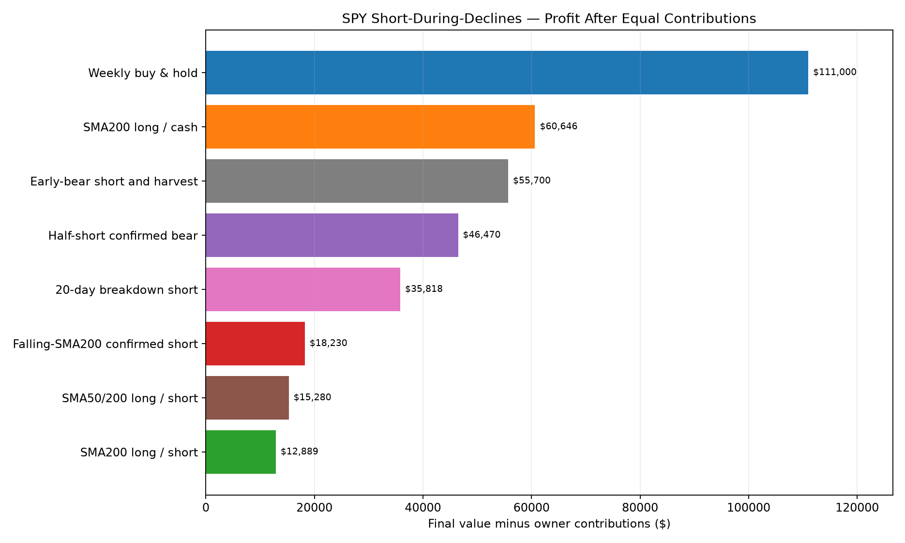
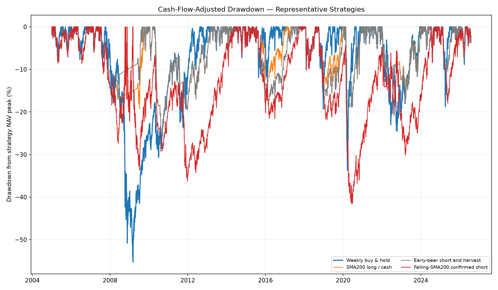
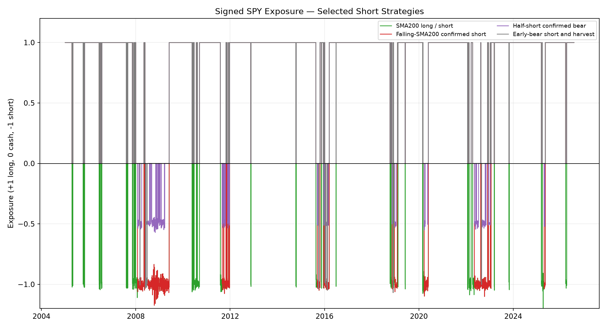

# SPY Short-During-Market-Declines Study

Study period: **2005-01-03 through 2026-07-30**  
Asset: **SPY only, using dividend- and split-adjusted OHLC bars**  
Owner contribution: **$25 on the first trading day of every ISO week**  
Base assumptions: **3% cash yield, 1% annual SPY borrow fee, 5 bps per side**  
Execution: **completed closing signal, next-session open trade**

## Bottom line

No short-enabled rule beat weekly buy-and-hold. The best actual short rule was **Early-bear short and harvest**, behind by **$55,299**. The non-short SMA200 long/cash control was also behind by **$50,354**. No short-enabled rule beat weekly buy-and-hold in the 2022–2026 holdout.

Every strategy received exactly **$28,150**. A short strategy must beat the control after borrow fees, dividend liability, trading costs and whipsaws to qualify as an edge. Full-history performance alone is not sufficient.

## Full-period results

| Rank | Strategy | Contributed | Final value | Profit | IRR | TWR CAGR | Max DD | Days short | Borrow cost | Trading cost |
|---:|---|---:|---:|---:|---:|---:|---:|---:|---:|---:|
| 1 | Weekly buy & hold | $28,150 | $139,150 | $111,000 | 13.04% | 10.77% | -55.30% | 0.00% | $0 | $14 |
| 2 | SMA200 long / cash | $28,150 | $88,796 | $60,646 | 9.61% | 8.02% | -24.10% | 0.00% | $0 | $1,461 |
| 3 | Early-bear short and harvest | $28,150 | $83,850 | $55,700 | 9.17% | 7.85% | -24.10% | 0.76% | $21 | $1,578 |
| 4 | Half-short confirmed bear | $28,150 | $74,620 | $46,470 | 8.25% | 6.97% | -26.19% | 7.70% | $160 | $1,735 |
| 5 | 20-day breakdown short | $28,150 | $63,968 | $35,818 | 7.03% | 6.00% | -32.60% | 4.70% | $179 | $1,584 |
| 6 | Falling-SMA200 confirmed short | $28,150 | $46,380 | $18,230 | 4.39% | 3.84% | -41.60% | 13.69% | $444 | $1,483 |
| 7 | SMA50/200 long / short | $28,150 | $43,430 | $15,280 | 3.84% | 4.46% | -44.62% | 20.38% | $694 | $505 |
| 8 | SMA200 long / short | $28,150 | $41,039 | $12,889 | 3.35% | 1.76% | -47.83% | 19.77% | $613 | $1,931 |

## Equal-contribution profit



## Cash-flow-adjusted drawdown



## Long, cash and short exposure



## Subperiod stability

Each segment starts from zero and receives its own $25 weekly contributions. The rules and thresholds are unchanged between segments.

| Strategy | Development final | vs B&H | Validation final | vs B&H | Holdout final | vs B&H | Periods won |
|---|---:|---:|---:|---:|---:|---:|---:|
| Weekly buy & hold | $29,067 | $0 | $10,875 | $0 | $9,105 | $0 | 0/3 |
| SMA200 long / cash | $23,864 | $-5,203 | $9,555 | $-1,320 | $8,224 | $-881 | 0/3 |
| SMA200 long / short | $16,119 | $-12,948 | $7,984 | $-2,891 | $7,085 | $-2,020 | 0/3 |
| Falling-SMA200 confirmed short | $19,356 | $-9,711 | $7,582 | $-3,292 | $7,466 | $-1,639 | 0/3 |
| Half-short confirmed bear | $22,888 | $-6,179 | $8,893 | $-1,981 | $8,003 | $-1,102 | 0/3 |
| SMA50/200 long / short | $18,195 | $-10,872 | $7,120 | $-3,754 | $6,947 | $-2,158 | 0/3 |
| 20-day breakdown short | $21,008 | $-8,059 | $8,274 | $-2,601 | $8,173 | $-932 | 0/3 |
| Early-bear short and harvest | $23,021 | $-6,046 | $9,429 | $-1,445 | $8,217 | $-888 | 0/3 |

## Short-borrow-rate sensitivity

The trading cost stays at 5 bps and cash yield stays at 3%. Short-sale proceeds receive no interest.

| Strategy | 0% borrow | 1% borrow | 3% borrow | 6% borrow |
|---|---:|---:|---:|---:|
| Weekly buy & hold | $139,150 | $139,150 | $139,150 | $139,150 |
| SMA200 long / cash | $88,796 | $88,796 | $88,796 | $88,796 |
| SMA200 long / short | $41,856 | $41,039 | $39,427 | $37,178 |
| Falling-SMA200 confirmed short | $47,041 | $46,380 | $45,049 | $43,164 |
| Half-short confirmed bear | $74,956 | $74,620 | $73,955 | $72,972 |
| SMA50/200 long / short | $44,417 | $43,430 | $41,500 | $38,829 |
| 20-day breakdown short | $64,268 | $63,968 | $63,275 | $62,252 |
| Early-bear short and harvest | $83,903 | $83,850 | $83,726 | $83,539 |

## Transaction-cost sensitivity

The short borrow fee stays at 1% annually.

| Strategy | 0 bps | 5 bps | 10 bps |
|---|---:|---:|---:|
| Weekly buy & hold | $139,219 | $139,150 | $139,080 |
| SMA200 long / cash | $92,137 | $88,796 | $85,600 |
| SMA200 long / short | $43,899 | $41,039 | $38,422 |
| Falling-SMA200 confirmed short | $48,729 | $46,380 | $44,179 |
| Half-short confirmed bear | $78,346 | $74,620 | $71,115 |
| SMA50/200 long / short | $44,160 | $43,430 | $42,715 |
| 20-day breakdown short | $67,118 | $63,968 | $61,005 |
| Early-bear short and harvest | $87,464 | $83,850 | $80,418 |

## Rules tested

### Weekly buy & hold

Invest every weekly contribution in SPY and remain long. This is the primary control.

### SMA200 long / cash

Hold +1× SPY above SMA200 and cash below it. This isolates whether shorting improves on ordinary defensive timing.

### SMA200 long / short

Hold +1× above SMA200 and -1× below SMA200.

### Falling-SMA200 confirmed short

Hold +1× above SMA200, -1× only when below a falling SMA200, and cash when below a flat or rising SMA200.

### Half-short confirmed bear

Hold +1× above SMA200. Hold -0.5× only when below a falling SMA200 and the trailing 20-day return is negative; otherwise hold cash.

### SMA50/200 long / short

Hold +1× when SMA50 is at or above SMA200 and -1× when SMA50 is below SMA200.

### 20-day breakdown short

Hold +1× above SMA200. Enter -1× on a new prior-20-day-low breakdown below a falling SMA200, then cover to cash after closing above SMA20.

### Early-bear short and harvest

Use the same breakdown entry, but cover when SPY closes above SMA20, reaches a 15% drawdown, or RSI falls below 30. This attempts to capture the early decline without shorting an already-stretched market.

## Realism and no-look-ahead controls

1. Each target uses data available at the previous completed close and executes at the next open.
2. Weekly deposits are identical across strategies and do not alter the signal.
3. Trading costs apply to entries, exits, flips and contribution rebalances.
4. Short notional pays the configured annual stock-borrow fee each day.
5. Because the adjusted SPY return includes distributions, a short receives the opposite total return and therefore bears the dividend liability.
6. Short-sale proceeds are bookkeeping collateral, not free capital: they earn no cash yield and exposure is capped at 1× short.
7. A short is forcibly covered if equity falls below 30% of short market value at the open or intraday high, followed by a 20-session short lockout.
8. The trade audit stores both `signal_date` and `trade_date`.

## Limitations

- Adjusted OHLC bars are research data, not executable historical quotes. Intraday spreads and borrow-rate changes are approximated.
- A constant borrow fee is necessarily simplified. SPY is generally liquid, but actual broker availability, margin rules and rates vary.
- Taxes are excluded. Frequent flips and short-term gains can materially worsen taxable-account results.
- The comparison tests several related rules on one history, creating selection risk. A small full-period winner that fails later segments should be treated as noise.
- Direct shorting can lose more than the initial short-sale proceeds during a sufficiently large rally. The 1× cap and maintenance test reduce but do not eliminate this risk.

## Files and reproduction

- `spy_short_decline_results.csv`: full-period ranking.
- `spy_short_decline_subperiods.csv`: development, validation and holdout runs.
- `spy_short_decline_borrow_sensitivity.csv`: borrow-fee stress test.
- `spy_short_decline_cost_sensitivity.csv`: turnover-cost stress test.
- `spy_short_decline_trades.csv`: causal execution audit.

```powershell
.\.venv\Scripts\python.exe studies\run_spy_short_decline_study.py
```
