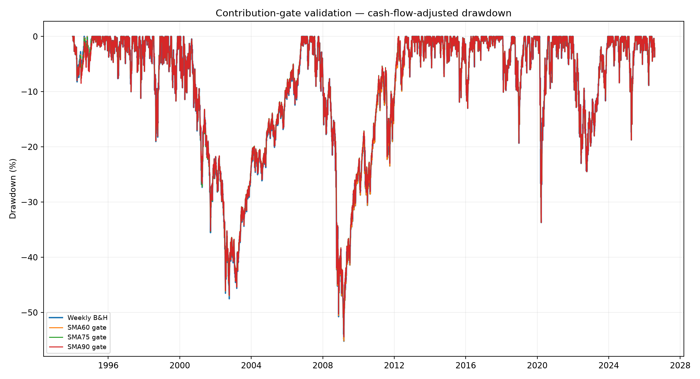
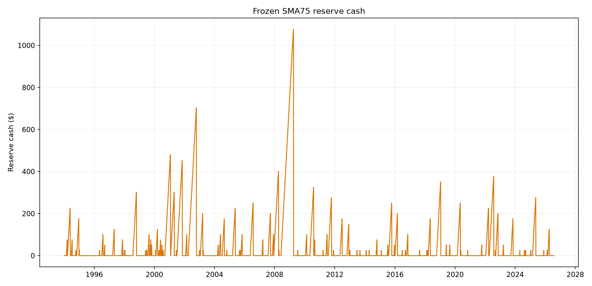
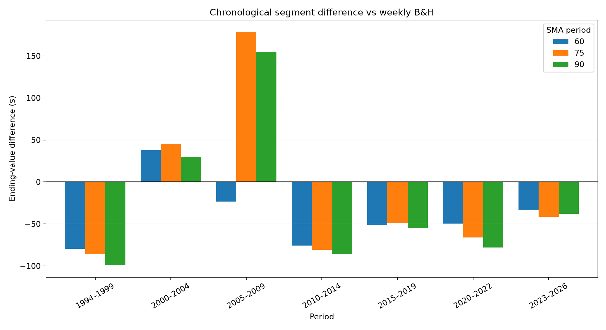
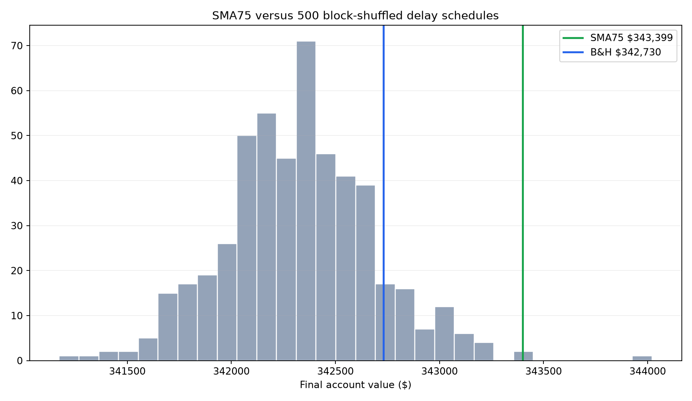

# SPY SMA75 Contribution-Gate Validation

Study period: **1994-01-03 through 2026-07-30**  
SPY history available: **1993-01-29 through 2026-07-30**  
Contribution: **$25 on the first trading session of every ISO week**  
Cash-yield source: **FRED DGS3MO**  
Base transaction cost: **5 basis points per purchase**

## Verdict

**REJECTED AS A PROVEN EDGE — 4/13 predeclared validation gates passed.**

The frozen SMA75 contribution gate ended at **$343,399**, versus **$342,730** for immediate weekly B&H, a difference of **$669**. With cash interest removed, its difference was **$368**.

Despite the higher ending balance, SMA75's time-weighted CAGR was **10.82%**, below B&H at **10.85%**. Its cumulative active log return was also negative. Equal contributions make ending dollars comparable, but the exact sequence of returns and growing deposits can still produce a small dollar win without a superior unitized return stream. This is a central reason the result is not confirmed.

The strategy won **2/7** chronological segments and ranked at the **99.40% percentile** of 500 block-shuffled delay schedules. Its bootstrap 95% interval for annualized active log return was **-0.13% to 0.08%**.

## Frozen rule

Existing SPY shares are never sold.

1. Add $25 on the first trading session of each week.
2. At that session's open, compare the **prior completed close** with its SMA75.
3. If the prior close is above SMA75, invest the new $25 and all accumulated reserve cash at the current open.
4. Otherwise retain the new contribution in cash until a later weekly review opens the gate.
5. Apply the cash yield only to the reserve and charge the configured purchase cost.

This is stricter than the exploratory report's older implementation, which could release reserved cash when a daily gate reopened. The confirmation figures therefore replace—not reproduce—the exploratory headline.

## Full-history results

| Strategy | Contributed | Final value | vs B&H | IRR | TWR CAGR | Max DD | Delayed | Cash interest |
|---|---:|---:|---:|---:|---:|---:|---:|---:|
| SMA75 gate + fixed 3% yield | $42,500 | $343,563 | $833 | 10.76% | 10.82% | -54.34% | 480 | $48 |
| SMA75 gate + historical yield | $42,500 | $343,399 | $669 | 10.76% | 10.82% | -54.36% | 480 | $31 |
| SMA75 gate + 0% cash yield | $42,500 | $343,098 | $368 | 10.75% | 10.80% | -54.37% | 480 | $0 |
| SMA90 gate + historical yield | $42,500 | $342,865 | $135 | 10.75% | 10.79% | -54.43% | 454 | $36 |
| Weekly B&H | $42,500 | $342,730 | $0 | 10.75% | 10.85% | -55.21% | 0 | $0 |
| SMA60 gate + historical yield | $42,500 | $341,630 | $-1,100 | 10.73% | 10.80% | -55.17% | 503 | $29 |





## Chronological evidence

Each segment begins with no shares and receives its own weekly contributions. The rule is unchanged.

| Period | SMA75 final | B&H final | Difference | Delayed contributions |
|---|---:|---:|---:|---:|
| 1994–1999 | $16,874 | $16,960 | $-85 | 65 |
| 2000–2004 | $7,402 | $7,357 | $45 | 119 |
| 2005–2009 | $6,592 | $6,413 | $179 | 101 |
| 2010–2014 | $9,934 | $10,015 | $-81 | 59 |
| 2015–2019 | $9,232 | $9,281 | $-49 | 58 |
| 2020–2022 | $4,034 | $4,100 | $-66 | 47 |
| 2023–2026 | $6,563 | $6,604 | $-41 | 31 |



## Parameter neighborhood

SMA60, SMA75 and SMA90 were run as a robustness neighborhood. SMA75 remains the frozen center regardless of which result ranks highest; the neighbors are not a new optimization search.

- Neighboring rules beating B&H: **2/3**.
- SMA60 difference: **$-1,100**.
- SMA75 difference: **$669**.
- SMA90 difference: **$135**.

## Is the result timing or cash interest?

- SMA75 with historical T-bill yield: **$343,399**.
- SMA75 with 0% reserve yield: **$343,098**.
- Dollar benefit associated with historical reserve interest: **$301**.
- Immediate weekly B&H: **$342,730**.

A rule that wins only after crediting cash interest has not demonstrated that SMA75 improved purchase timing. It has demonstrated that earning interest on delayed contributions helped in this sample.

## Crisis dependence

| Segment | Active log return | Share of total |
|---|---:|---:|
| 2008 financial crisis | 0.73% | -83.62% |
| 2020 COVID crash | -0.02% | 2.27% |
| All dates outside both windows | -1.59% | 181.35% |
| Total | -0.87% | 100.00% |

## Random-delay control

The weekly open/closed states were divided into four-week blocks and shuffled 500 times. This preserves the approximate amount and clustering of delayed capital while removing the SMA75 relationship to market prices.

- Random-delay median final value: **$342,329**.
- Random-delay 95th percentile: **$342,975**.
- Random schedules finishing below SMA75: **497/500**.



## Cost and yield stress

| Cash yield | Cost | Final value | vs B&H | Cash interest |
|---|---:|---:|---:|---:|
| 0% | 0.05% | $343,098 | $368 | $0 |
| 0% | 0.10% | $342,927 | $368 | $0 |
| 0% | 0.20% | $342,585 | $368 | $0 |
| 3% | 0.05% | $343,563 | $833 | $48 |
| 3% | 0.10% | $343,392 | $833 | $48 |
| 3% | 0.20% | $343,049 | $832 | $48 |
| Historical T-bill | 0.05% | $343,399 | $669 | $31 |
| Historical T-bill | 0.10% | $343,228 | $669 | $31 |
| Historical T-bill | 0.20% | $342,885 | $668 | $31 |

Stress cases beating the fixed-cost B&H benchmark: **9/9**.

## Largest reserve deployments

| Re-entry date | Signal date | Reserve deployed | Approx. weeks accumulated | Execution open |
|---|---|---:|---:|---:|
| 2009-04-06 | 2009-04-03 | $1,101 | 43 | $61.22 |
| 2002-10-21 | 2002-10-18 | $728 | 28 | $57.13 |
| 2001-01-29 | 2001-01-26 | $505 | 19 | $85.80 |
| 2001-11-12 | 2001-11-09 | $477 | 18 | $70.94 |
| 2008-04-07 | 2008-04-04 | $426 | 16 | $98.69 |
| 2022-08-01 | 2022-07-29 | $401 | 15 | $387.84 |
| 2019-01-22 | 2019-01-18 | $376 | 14 | $236.90 |
| 2010-08-09 | 2010-08-06 | $350 | 13 | $85.02 |
| 1998-10-26 | 1998-10-23 | $327 | 12 | $66.56 |
| 2001-04-30 | 2001-04-27 | $326 | 12 | $80.28 |
| 2025-05-19 | 2025-05-16 | $301 | 11 | $579.94 |
| 2011-10-17 | 2011-10-14 | $300 | 11 | $94.18 |

These are not sales or market exits. They are accumulated weekly contributions finally entering SPY after the gate reopened.

## Statistical checks

- Annualized mean active log return: **-0.03%**.
- Bootstrap probability of a non-positive edge: **69.70%**.
- Bootstrap 95% interval: **-0.13% to 0.08%**.
- Annualized active Sharpe: **-0.07**.
- Deflated Sharpe probability after **560** known prior trials: **0.02%**.

## Validation gates

- PASS — Full history beats weekly B&H
- FAIL — Time-weighted CAGR beats weekly B&H
- FAIL — 1994–2004 combined evidence beats B&H
- FAIL — At least 70% of chronological segments beat B&H
- FAIL — Positive median segment result
- FAIL — SMA60, SMA75 and SMA90 all beat B&H
- PASS — SMA75 beats B&H with 0% cash yield
- FAIL — Positive active return outside 2008 and 2020
- FAIL — Bootstrap 95% interval above zero
- FAIL — Deflated Sharpe probability at least 95%
- PASS — SMA75 beats 95th percentile random delay
- PASS — At least 70% of cost/yield stresses beat B&H
- FAIL — Drawdown improves by at least 3 percentage points

## Limitations

1. The rule was discovered after inspecting 2005–2026, and the 1993–2026 SPY history has now been reused across many studies. Chronological segmentation cannot restore a truly untouched holdout.
2. DGS3MO is a Treasury-market reference yield, not a guarantee that a brokerage account would have earned that rate after fund expenses, spreads or taxes.
3. Adjusted Yahoo OHLC data are used. They are practical for total-return research but are not raw historical execution prices.
4. Taxes on cash interest are excluded. The strategy makes purchases only and does not realize gains from existing SPY shares.
5. Random block schedules are a diagnostic null model, not a perfect representation of every possible contribution-delay strategy.
6. The strategy differs from B&H only during below-SMA75 weeks. There are far fewer independent gate cycles than daily observations.
7. A small ending-value advantage may be real but economically too weak to distinguish reliably from market-path noise.

## Decision

Treat the SMA75 gate as confirmed only if the verdict is **SUPPORTED**. A higher full-period balance by itself is insufficient. If the 0%-yield rule, chronological folds, bootstrap interval or random-delay comparison fail, immediate weekly B&H remains the better-supported default.

The only source of genuinely new evidence now is a frozen forward paper log containing each prior-close signal, weekly opening execution price, contribution, reserve balance and simultaneous B&H purchase.

## Reproduction

- `spy_sma75_contribution_results.csv`
- `spy_sma75_contribution_segments.csv`
- `spy_sma75_contribution_stress.csv`
- `spy_sma75_contribution_random_controls.csv`
- `spy_sma75_contribution_crisis.csv`
- `spy_sma75_contribution_releases.csv`
- `spy_sma75_contribution_decisions.csv`

```powershell
.\.venv\Scripts\python.exe studies\run_spy_sma75_contribution_validation.py
```
