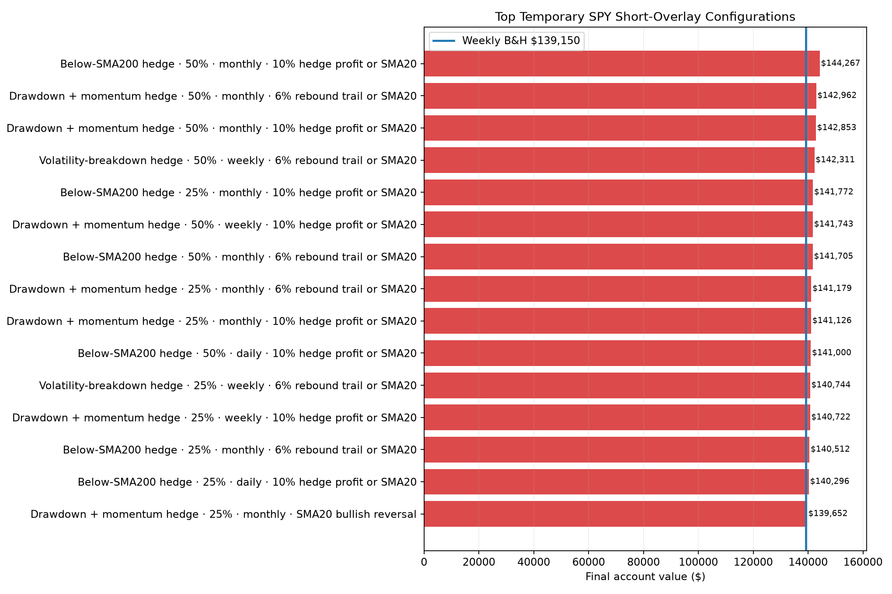
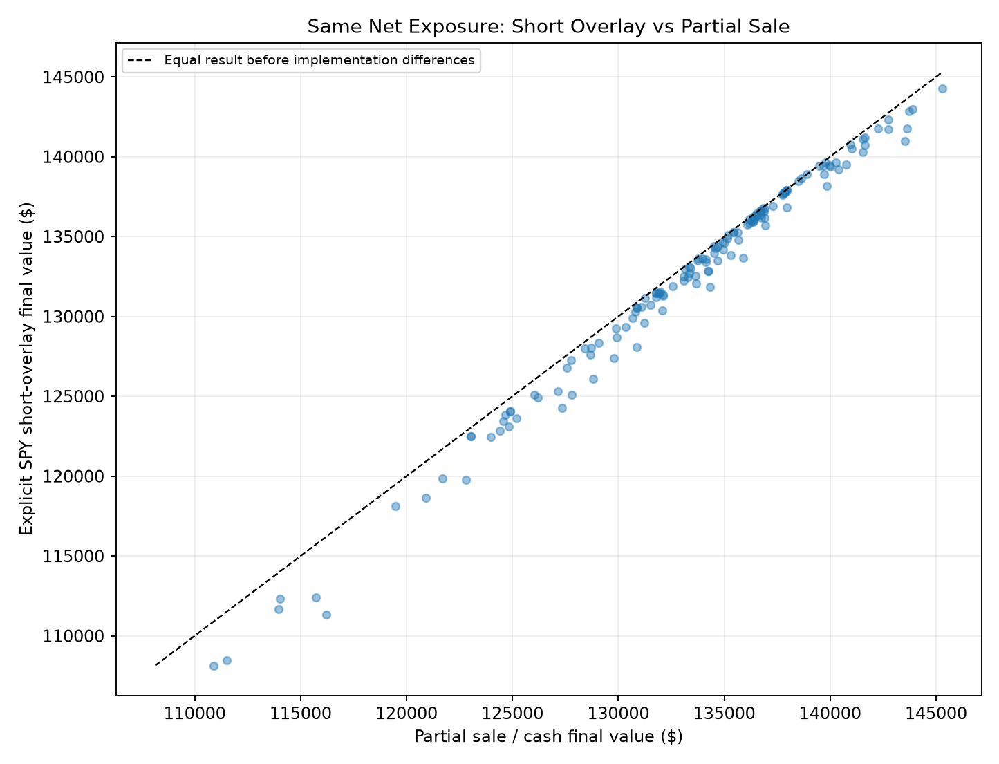
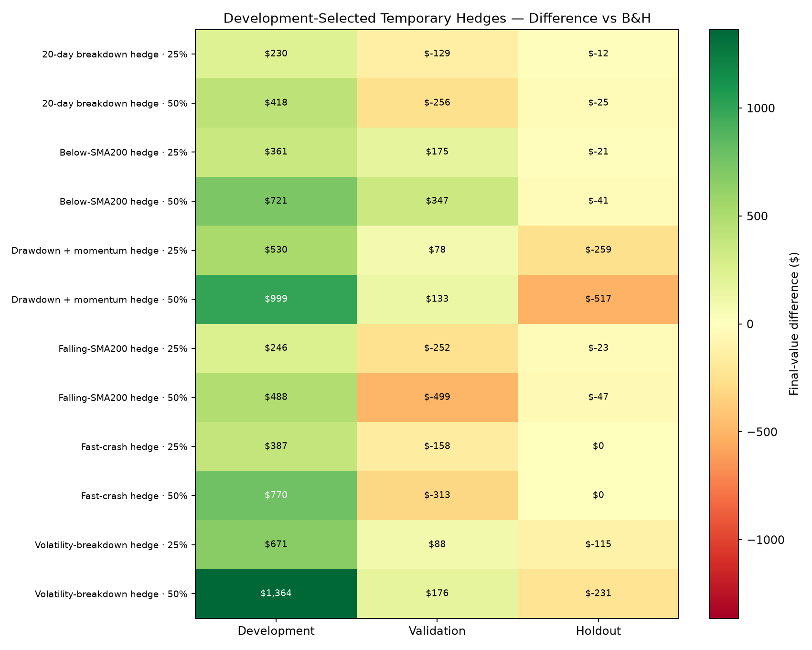
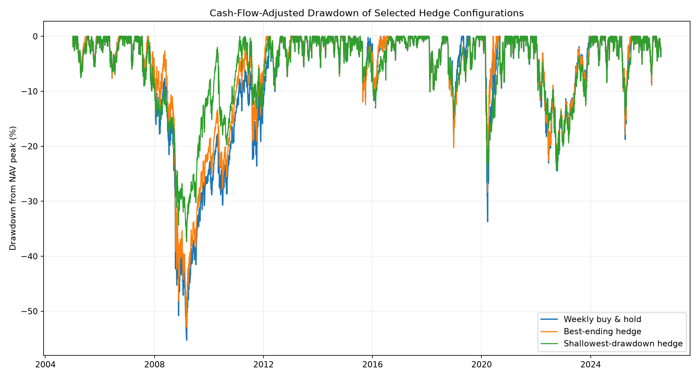
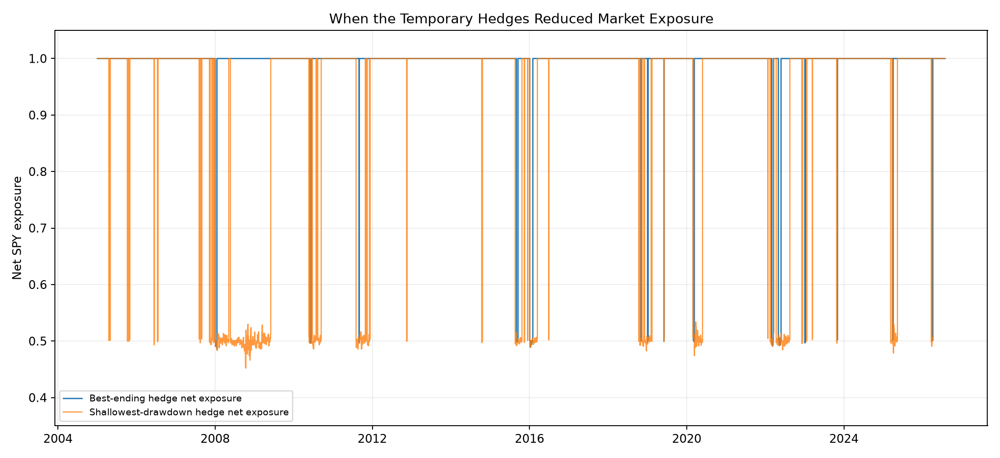

# SPY Temporary Short-Hedge Study

Study period: **2005-01-03 through 2026-07-30**  
Portfolio: **1× long SPY core with a temporary 25% or 50% SPY short overlay**  
Owner contribution: **$25 every week for every configuration**  
Search: **144 short-overlay configurations plus 144 economically equivalent partial-sale controls**  
Costs: **5 bps per trade, 1% annual SPY borrow fee, 3% eligible cash yield**

## Bottom line

22 of 144 explicit short-overlay configurations beat weekly B&H over the full history. The best was **Below-SMA200 hedge**, 50.00% hedge, monthly review, 10% hedge profit or SMA20, ahead by **$5,117**. No development-selected hedge configuration beat B&H in both validation and holdout.

Every full-period account received exactly **$28,150**. Weekly B&H finished at **$139,150**.

The most important structural finding is that shorting SPY while already long SPY does not create a new source of market return. A 1× long core plus a 0.25× SPY short has **0.75× net SPY exposure**, economically similar to selling 25% of the long position. The explicit overlay then adds borrow fees, gross exposure and additional execution complexity.

The best equivalent partial-sale version finished at **$145,282**, **$6,132 above B&H**. The explicit short overlay beat its paired cash implementation in **0 of 144** comparisons.

## Best full-period explicit hedges

| Rank | Trigger | Hedge | Review | Exit | Final value | vs B&H | IRR | Max DD | Days hedged | Borrow cost |
|---:|---|---:|---|---|---:|---:|---:|---:|---:|---:|
| 1 | Below-SMA200 hedge | 50.00% | Monthly | 10% hedge profit or SMA20 | $144,267 | $5,117 | 13.31% | -52.88% | 2.06% | $97 |
| 2 | Drawdown + momentum hedge | 50.00% | Monthly | 6% rebound trail or SMA20 | $142,962 | $3,813 | 13.24% | -52.32% | 2.23% | $86 |
| 3 | Drawdown + momentum hedge | 50.00% | Monthly | 10% hedge profit or SMA20 | $142,853 | $3,703 | 13.23% | -54.86% | 2.05% | $83 |
| 4 | Volatility-breakdown hedge | 50.00% | Weekly | 6% rebound trail or SMA20 | $142,311 | $3,162 | 13.20% | -47.71% | 1.18% | $33 |
| 5 | Below-SMA200 hedge | 25.00% | Monthly | 10% hedge profit or SMA20 | $141,772 | $2,622 | 13.18% | -54.10% | 2.06% | $47 |
| 6 | Drawdown + momentum hedge | 50.00% | Weekly | 10% hedge profit or SMA20 | $141,743 | $2,594 | 13.17% | -52.58% | 4.75% | $157 |
| 7 | Below-SMA200 hedge | 50.00% | Monthly | 6% rebound trail or SMA20 | $141,705 | $2,555 | 13.17% | -53.89% | 2.25% | $97 |
| 8 | Drawdown + momentum hedge | 25.00% | Monthly | 6% rebound trail or SMA20 | $141,179 | $2,030 | 13.14% | -53.80% | 2.23% | $42 |
| 9 | Drawdown + momentum hedge | 25.00% | Monthly | 10% hedge profit or SMA20 | $141,126 | $1,976 | 13.14% | -55.07% | 2.05% | $41 |
| 10 | Below-SMA200 hedge | 50.00% | Daily | 10% hedge profit or SMA20 | $141,000 | $1,851 | 13.14% | -53.66% | 6.45% | $245 |
| 11 | Volatility-breakdown hedge | 25.00% | Weekly | 6% rebound trail or SMA20 | $140,744 | $1,595 | 13.12% | -51.59% | 1.18% | $16 |
| 12 | Drawdown + momentum hedge | 25.00% | Weekly | 10% hedge profit or SMA20 | $140,722 | $1,573 | 13.12% | -53.92% | 4.75% | $76 |
| 13 | Below-SMA200 hedge | 25.00% | Monthly | 6% rebound trail or SMA20 | $140,512 | $1,363 | 13.11% | -54.58% | 2.25% | $48 |
| 14 | Below-SMA200 hedge | 25.00% | Daily | 10% hedge profit or SMA20 | $140,296 | $1,147 | 13.10% | -54.44% | 6.45% | $122 |
| 15 | Drawdown + momentum hedge | 25.00% | Monthly | SMA20 bullish reversal | $139,652 | $502 | 13.06% | -53.93% | 3.04% | $50 |



## What the leading hedge did in 2008 and 2020

| Episode | Trade date | Action | SPY price | Reason |
|---|---:|---|---:|---|
| Financial crisis | 2008-01-02 | Enter 50% hedge | $104.37 | close below SMA200 |
| Financial crisis | 2008-01-18 | Cover hedge | $93.93 | 10% hedge-profit target |
| Financial crisis | 2010-06-01 | Enter 50% hedge | $81.19 | close below SMA200 |
| Financial crisis | 2010-06-14 | Cover hedge | $82.82 | prior close above SMA20 |
| COVID crash | 2019-01-02 | Enter 50% hedge | $220.05 | close below SMA200 |
| COVID crash | 2019-01-08 | Cover hedge | $229.75 | prior close above SMA20 |
| COVID crash | 2019-06-03 | Enter 50% hedge | $247.37 | close below SMA200 |
| COVID crash | 2019-06-06 | Cover hedge | $254.54 | prior close above SMA20 |
| COVID crash | 2020-03-02 | Enter 50% hedge | $271.82 | close below SMA200 |
| COVID crash | 2020-03-12 | Cover hedge | $233.35 | gap through 10% hedge-profit target |

The winning historical pattern was not a perfect top-to-bottom short. It captured an early 10% decline with a half-sized hedge, covered, and restored full long exposure. The core SPY position remained invested throughout, allowing participation in the eventual rebound.

## Explicit short overlay versus partial sale

Each dot uses the same trigger, hedge size, review schedule and exit. Before costs and cash yield, paired implementations have the same net SPY exposure.

| Hedge size | Review | Best short-overlay final | Best cash-de-risk final | Median overlay minus cash | Overlay wins |
|---:|---|---:|---:|---:|---:|
| 25.00% | Daily | $140,296 | $141,548 | $-573 | 0/24 |
| 25.00% | Monthly | $141,772 | $142,266 | $-159 | 0/24 |
| 25.00% | Weekly | $140,744 | $141,636 | $-382 | 0/24 |
| 50.00% | Daily | $141,000 | $143,541 | $-1,108 | 0/24 |
| 50.00% | Monthly | $144,267 | $145,282 | $-314 | 0/24 |
| 50.00% | Weekly | $142,311 | $143,619 | $-762 | 0/24 |



## Development selection and later-period evaluation

For each trigger and hedge size, the review schedule and exit with the highest 2005–2016 final value was frozen. Those choices were then evaluated separately on 2017–2021 and 2022–2026.

| Trigger / hedge size | Development-selected review and exit | Development vs B&H | Validation vs B&H | Holdout vs B&H | Won both later periods |
|---|---|---:|---:|---:|---:|
| Below-SMA200 hedge / 25.00% | Monthly, 10% hedge profit or SMA20 | $361 | $175 | $-21 | No |
| Below-SMA200 hedge / 50.00% | Monthly, 10% hedge profit or SMA20 | $721 | $347 | $-41 | No |
| Falling-SMA200 hedge / 25.00% | Monthly, SMA20 bullish reversal | $246 | $-252 | $-23 | No |
| Falling-SMA200 hedge / 50.00% | Monthly, SMA20 bullish reversal | $488 | $-499 | $-47 | No |
| 20-day breakdown hedge / 25.00% | Weekly, SMA20 bullish reversal | $230 | $-129 | $-12 | No |
| 20-day breakdown hedge / 50.00% | Weekly, SMA20 bullish reversal | $418 | $-256 | $-25 | No |
| Volatility-breakdown hedge / 25.00% | Weekly, 6% rebound trail or SMA20 | $671 | $88 | $-115 | No |
| Volatility-breakdown hedge / 50.00% | Weekly, 6% rebound trail or SMA20 | $1,364 | $176 | $-231 | No |
| Drawdown + momentum hedge / 25.00% | Weekly, SMA20 bullish reversal | $530 | $78 | $-259 | No |
| Drawdown + momentum hedge / 50.00% | Weekly, SMA20 bullish reversal | $999 | $133 | $-517 | No |
| Fast-crash hedge / 25.00% | Monthly, 6% rebound trail or SMA20 | $387 | $-158 | $0 | No |
| Fast-crash hedge / 50.00% | Monthly, 6% rebound trail or SMA20 | $770 | $-313 | $0 | No |



## Drawdown and hedge timing

The shallowest-drawdown configuration was **Below-SMA200 hedge**, 50.00%, daily review with **Trigger clears**. It produced a **-37.36%** maximum drawdown and **$111,309** final value.





## Borrow-cost sensitivity of the full-period leader

| Annual borrow fee | Final value | vs B&H | Total borrow cost |
|---:|---:|---:|---:|
| 0.00% | $144,516 | $5,366 | $0 |
| 1.00% | $144,267 | $5,117 | $97 |
| 3.00% | $143,771 | $4,621 | $290 |
| 6.00% | $143,030 | $3,881 | $577 |

## Hedge-entry triggers

- **Below SMA200:** hedge whenever the scheduled prior close is below SMA200.
- **Falling SMA200:** require both price below SMA200 and SMA200 lower than 20 sessions earlier.
- **20-day breakdown:** require a new prior-20-day low below a falling SMA200.
- **Volatility breakdown:** require price below SMA200, negative 20-day momentum and annualized 20-day volatility above 30%.
- **Drawdown plus momentum:** require at least a 10% closing drawdown and negative 20-day return.
- **Fast crash:** require price below SMA50, an 8% or worse 20-day return and annualized volatility above 25%.

Entry signals are reviewed daily, weekly or monthly depending on the configuration. Weekly contributions do not force a new signal decision.

## Hedge exits

- **Trigger clears:** restore the full long core when the entry condition is false at the prior close.
- **SMA20 bullish reversal:** restore full long exposure after a completed close above SMA20.
- **6% rebound trail or SMA20:** track the lowest completed close during the hedge and cover if SPY rebounds 6%, or after an SMA20 recovery.
- **10% hedge profit or SMA20:** cover after SPY falls 10% from hedge entry, or after an SMA20 recovery.

After a hedge exits, its trigger must clear before another hedge can be armed. This prevents taking a profit and mechanically re-shorting the same uninterrupted decline every week.

## No-look-ahead and accounting controls

1. Entry and closing-signal exits use the previous completed close and trade at the next open.
2. The rebound trail uses the lowest **completed close** observed before the current session. A gap beyond the cover stop fills at the less favorable opening price.
3. Fixed hedge-profit orders can execute from adjusted daily lows at a resting target price.
4. The explicit overlay keeps a 1× long book and a separate short book capped at 0.50×; it cannot reinvest short-sale proceeds as added long exposure.
5. Short notional pays borrow daily and adjusted SPY returns impose the dividend liability.
6. Both long and short trades pay transaction costs, including weekly contribution rebalancing.
7. Cash de-risking earns the assumed cash yield; restricted short collateral does not.
8. Trade logs retain `signal_date` and `trade_date` for causal auditing.

## Limitations

- Long and short positions in the identical security may be netted by a broker rather than maintained as separate books. The overlay is best interpreted as the economics of a separate hedge vehicle.
- Taxes, varying borrow rates, inverse-ETF decay, options pricing and broker-specific margin rules are excluded.
- Adjusted OHLC bars are research data rather than executable quotes.
- The full ranking searches many related configurations. The development-selected validation and holdout results are the primary evidence.
- A hedge can reduce crash damage but will normally sacrifice return during false alarms and rapid V-shaped recoveries.

## Output files

- `spy_temporary_hedge_overlays.csv`: all explicit short-overlay results.
- `spy_temporary_hedge_derisk.csv`: paired partial-sale/cash results.
- `spy_temporary_hedge_pairs.csv`: direct implementation comparison.
- `spy_temporary_hedge_selected_oos.csv`: development-selected later-period results.
- `spy_temporary_hedge_best_trades.csv`: full-period leader audit.

```powershell
.\.venv\Scripts\python.exe studies\run_spy_temporary_hedge_study.py
```
