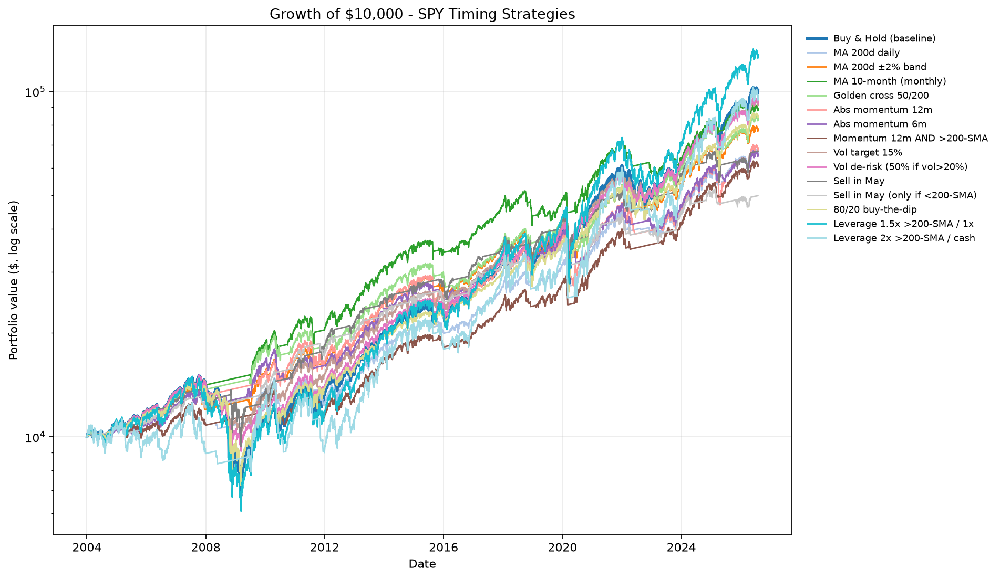
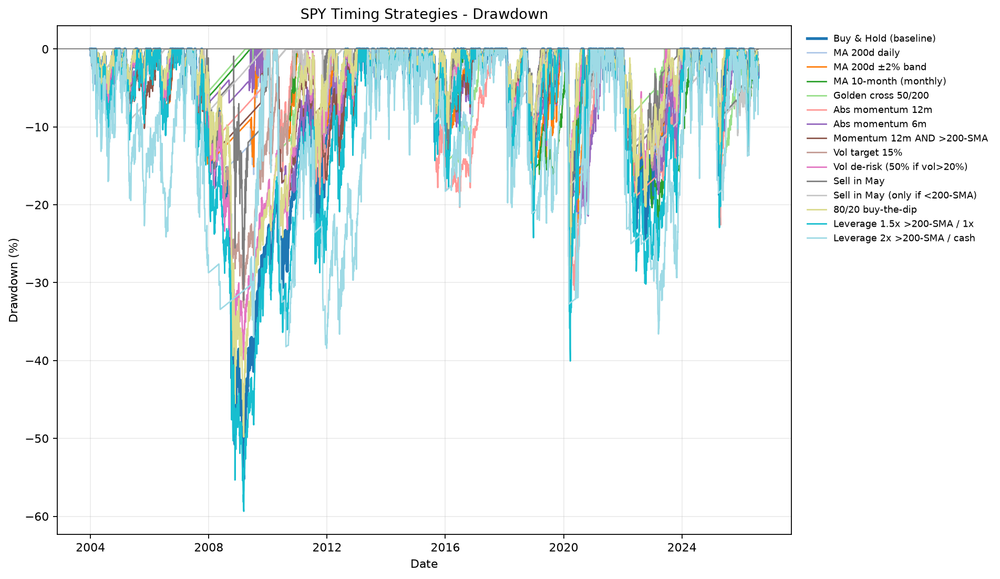

# SPY Market-Timing Study

**Study period:** 2004-01-02 through 2026-07-30  
**Observations:** 5,679 daily bars  
**Starting capital:** $10,000 lump sum per strategy  
**Data:** dividend- and split-adjusted SPY daily prices  
**Trading assumptions:** 0.05% transaction cost per side, 4.5% annual yield on positive cash, 5.5% annual borrowing cost, and a 3% rebalance band.

## Executive Summary

- **Buy & Hold finished with $100,713.35** from the original $10,000.
- **Leverage 1.5x above the 200-day SMA / 1x otherwise finished highest at $128,019.83**, but it also suffered the deepest drawdown at -59.36%.
- **No unleveraged timing strategy beat Buy & Hold on ending dollars or CAGR.**
- **Leverage 2x above the 200-day SMA / cash otherwise did not beat Buy & Hold** in the exact rerun: $97,502.56 versus $100,713.35.
- Timing strategies were most useful for reducing drawdown, not increasing final wealth.
- The highest Sharpe ratio was **Sell in May only if below the 200-day SMA** at 0.93, but its ending value was only $49,929.45.

## What “Total Invested” Means

This is a lump-sum study. Each strategy receives one **$10,000 capital contribution** on the first date. There are no later deposits or withdrawals.

Rebalancing does not count as additional invested capital; it moves the same portfolio between SPY and cash. The two leveraged strategies also start with only $10,000 of owner capital, but they can create market exposure above $10,000 by borrowing. Borrowing costs are included in their results.

## Total Invested and Final Amount

These ending values come directly from the timing engine’s final equity, not from CAGR-based estimates.

| Rank | Strategy | Total invested | Final amount | Net profit | Growth | Avg. exposure |
|---:|---|---:|---:|---:|---:|---:|
| 1 | Leverage 1.5x >200-SMA / 1x | $10,000.00 | $128,019.83 | $118,019.83 | 12.80x | 140.0% |
| 2 | Buy & Hold (baseline) | $10,000.00 | $100,713.35 | $90,713.35 | 10.07x | 100.0% |
| 3 | Leverage 2x >200-SMA / cash | $10,000.00 | $97,502.56 | $87,502.56 | 9.75x | 161.7% |
| 4 | Vol de-risk (50% if vol >20%) | $10,000.00 | $93,859.44 | $83,859.44 | 9.39x | 90.4% |
| 5 | Vol target 15% | $10,000.00 | $92,534.61 | $82,534.61 | 9.25x | 89.0% |
| 6 | MA 10-month (monthly) | $10,000.00 | $89,429.46 | $79,429.46 | 8.94x | 81.2% |
| 7 | 80/20 buy-the-dip | $10,000.00 | $85,218.84 | $75,218.84 | 8.52x | 82.6% |
| 8 | Golden cross 50/200 | $10,000.00 | $83,608.65 | $73,608.65 | 8.36x | 80.4% |
| 9 | MA 200d ±2% band | $10,000.00 | $77,973.31 | $67,973.31 | 7.80x | 80.5% |
| 10 | Abs momentum 12m | $10,000.00 | $68,716.27 | $58,716.27 | 6.87x | 85.1% |
| 11 | Sell in May | $10,000.00 | $67,195.74 | $57,195.74 | 6.72x | 49.3% |
| 12 | MA 200d daily | $10,000.00 | $66,773.02 | $56,773.02 | 6.68x | 81.0% |
| 13 | Abs momentum 6m | $10,000.00 | $65,875.68 | $55,875.68 | 6.59x | 78.1% |
| 14 | Momentum 12m AND >200-SMA | $10,000.00 | $61,565.58 | $51,565.58 | 6.16x | 77.6% |
| 15 | Sell in May (only if <200-SMA) | $10,000.00 | $49,929.45 | $39,929.45 | 4.99x | 39.5% |

## Performance Ranking

The “Beat by 1%?” target requires a CAGR of at least **11.78%**, one percentage point above Buy & Hold’s 10.78%.

| Strategy | CAGR | CAGR vs. B&H | Max drawdown | Sharpe | Turnover/yr | Beat by 1%? |
|---|---:|---:|---:|---:|---:|:---:|
| 
| Buy & Hold (baseline) | 10.78% | +0.00% | -55.22% | 0.64 | 0.0x | — |
| Leverage 2x >200-SMA / cash | 10.62% | -0.16% | -38.44% | 0.55 | 30.5x | No |
| Vol de-risk (50% if vol >20%) | 10.43% | -0.35% | -39.90% | 0.79 | 7.0x | No |
| Vol target 15% | 10.36% | -0.42% | -33.23% | 0.83 | 6.0x | No |
| MA 10-month (monthly) | 10.19% | -0.58% | -23.17% | 0.85 | 6.4x | No |
| 80/20 buy-the-dip | 9.96% | -0.82% | -49.82% | 0.65 | 2.0x | No |
| Golden cross 50/200 | 9.87% | -0.91% | -33.73% | 0.76 | 2.9x | No |
| MA 200d ±2% band | 9.53% | -1.25% | -22.45% | 0.83 | 4.9x | No |
| Abs momentum 12m | 8.91% | -1.86% | -30.96% | 0.70 | 8.2x | No |
| Sell in May | 8.81% | -1.97% | -33.73% | 0.69 | 6.1x | No |
| MA 200d daily | 8.78% | -2.00% | -20.39% | 0.79 | 13.1x | No |
| Abs momentum 6m | 8.71% | -2.06% | -22.38% | 0.78 | 19.7x | No |
| Momentum 12m AND >200-SMA | 8.39% | -2.39% | -20.39% | 0.78 | 12.1x | No |
| Sell in May (only if <200-SMA) | 7.38% | -3.39% | -17.59% | 0.93 | 13.2x | No |

## Ending-Dollar Comparisons

### Highest final amount

The 1.5x/1x leveraged trend strategy ended at **$128,019.83**, which is:

- $27,306.48 more than Buy & Hold.
- 27.1% more ending wealth than Buy & Hold.
- Accompanied by a -59.36% maximum drawdown, deeper than Buy & Hold’s -55.22%.

This is additional compensated risk, not a free timing advantage.

### Best unleveraged ending amount

Buy & Hold was the best unleveraged strategy at **$100,713.35**.

The closest unleveraged alternatives were:

| Strategy | Final amount | Shortfall vs. B&H | Max drawdown |
|---|---:|---:|---:|
| Vol de-risk | $93,859.44 | -$6,853.91 | -39.90% |
| Vol target 15% | $92,534.61 | -$8,178.74 | -33.23% |
| MA 10-month monthly | $89,429.46 | -$11,283.89 | -23.17% |

### Lowest drawdown

Sell in May only if below the 200-day SMA had the shallowest maximum drawdown at **-17.59%**, but it ended at **$49,929.45**—$50,783.90 less than Buy & Hold.

## Growth of $10,000

## Drawdowns

## Interpretation

1. **Only one strategy cleared the +1 percentage-point CAGR goal:** the 1.5x/1x leveraged trend strategy.
2. **Leverage 2x/cash did not beat Buy & Hold in the exact refreshed run.** Its smaller drawdown came with a lower ending value and lower Sharpe ratio.
3. **Timing’s strongest benefit was drawdown control.** Volatility targeting, monthly moving-average timing, and conditional seasonality all reduced drawdowns materially.
4. **Drawdown reduction had a real opportunity cost.** The safest strategies spent much less time invested and therefore captured less of SPY’s long-run compounding.
5. **Monthly trend timing reduced whipsaw.** The 10-month monthly rule produced $89,429.46 with a -23.17% drawdown, versus $66,773.02 and -20.39% for the daily 200-day rule.
6. **Final wealth and risk-adjusted performance answer different questions.** Buy & Hold maximized unleveraged ending dollars; several timing rules delivered higher Sharpe or Calmar ratios.

## Strategy Notes

- **Moving-average and momentum rules:** reduce exposure during weak trends but can miss fast rebounds.
- **Monthly MA:** checks the trend less often, reducing turnover and false exits.
- **MA band:** requires price to move beyond a buffer before changing state, reducing whipsaw.
- **Volatility target/de-risk:** trims exposure when volatility rises instead of making a binary all-in/all-out decision.
- **Sell in May:** sacrifices substantial market exposure for lower risk.
- **Buy-the-dip 80/20:** stays mostly invested and increases exposure after a decline.
- **Leverage strategies:** can increase ending value, but borrowing costs and larger losses must be included.

## Method and Limitations

- Signals use information available through each daily close and are executed at that close in the current timing engine.
- SPY prices are adjusted for splits and dividends.
- Results include the configured transaction costs, cash yield, and margin interest.
- Taxes, bid-ask spread, market impact, fund expense ratios, and account-specific margin rules are not modeled.
- The study uses one historical sequence. It does not prove that the same ranking will persist.
- “Total invested” means owner capital contributed, not cumulative trading turnover or gross leveraged exposure.

## Conclusion

For maximizing unleveraged ending wealth over this period, **Buy & Hold won**. The only strategy that finished meaningfully higher used continuous leverage during strong trends and still maintained 1x exposure during weak trends.

For investors prioritizing shallower drawdowns, monthly trend timing and volatility-based exposure controls were more defensible than frequent daily timing. They reduced risk substantially, but every unleveraged version finished with less money than Buy & Hold.

The central trade-off is therefore clear:

- **Maximum unleveraged ending wealth:** Buy & Hold.
- **Higher ending wealth through more risk:** 1.5x/1x leveraged trend.
- **Better drawdown control:** monthly MA, volatility targeting, or conditional Sell in May.
