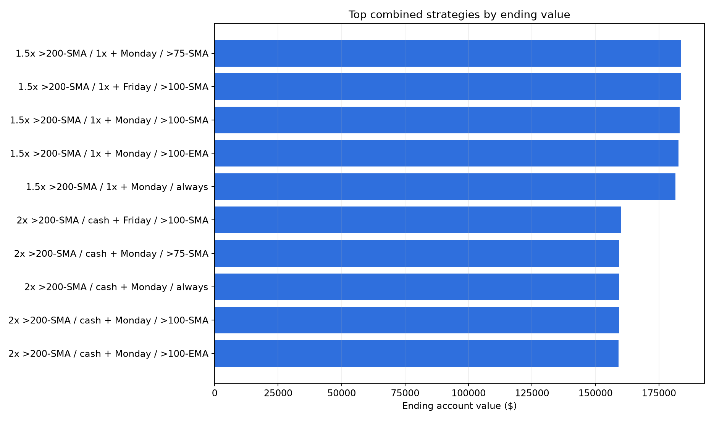
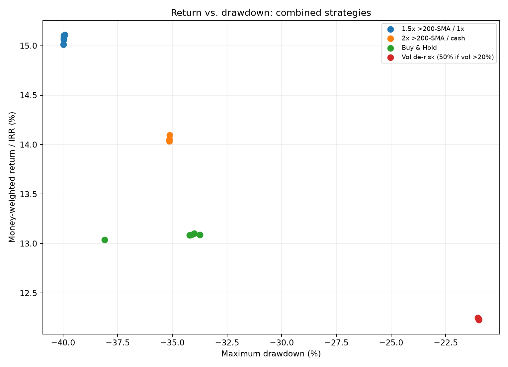

# SPY Timing + Weekly-Contribution Study

**Study period:** 2005-01-03 through 2026-07-30  
**Observations:** 5,427 daily bars  
**Contribution:** $25 each week  
**Total owner capital contributed:** $28,150 per strategy  
**Data:** dividend- and split-adjusted SPY daily prices

## Executive Summary

- The highest ending value was **$183,664.17** from **1.5x above the 200-day SMA / 1x otherwise, with weekly deposits held until SPY was above its 75-day SMA**. Its money-weighted return was **15.10%**, but maximum drawdown was **-39.96%**.
- The highest money-weighted return was **15.11%** from the same 1.5x/1x timing overlay with the **Friday / 100-day SMA** weekly policy. It finished with **$183,579.15**.
- The best middle-ground result was **2x above the 200-day SMA / cash otherwise, with Friday / 100-day SMA deposits**: **$160,109.90**, **14.10% IRR**, and **-35.12% maximum drawdown**.
- The best unleveraged combined result was **Buy & Hold + Monday / 75-day SMA**: **$140,362.33**, **13.10% IRR**, and **-33.99% maximum drawdown**.
- The volatility de-risk overlay produced the shallowest drawdown, about **-21.0%**, but its best ending value was only **$125,308.31**.
- Weekly contribution filters made small differences inside each timing family. The main performance driver was the timing overlay, especially leverage—not the weekday selected for the $25 deposit.

## Strategies Tested

The four timing overlays were selected by ending value from `spy_timing_study.md`:

1. 1.5x exposure above the 200-day SMA, 1x otherwise.
2. Buy & Hold.
3. 2x exposure above the 200-day SMA, cash otherwise.
4. 100% exposure normally, reduced to 50% when 20-day annualized volatility exceeds 20%.

Each overlay was combined with five weekly contribution policies:

1. Monday / always invest.
2. Monday / hold new deposits until SPY is above its 75-day SMA.
3. Friday / hold new deposits until SPY is above its 100-day SMA.
4. Monday / hold new deposits until SPY is above its 100-day EMA.
5. Monday / hold new deposits until SPY is above its 100-day SMA.

This produced **20 combined strategies**. The hindsight-only “buy the cheapest day of the week” rule was excluded because it cannot be traded live.

## Best Version of Each Timing Overlay

| Timing overlay | Best weekly policy by IRR | Total contributed | Final value | Profit | IRR | Max drawdown | Avg. exposure |
|---|---|---:|---:|---:|---:|---:|---:|
| 1.5x >200-SMA / 1x | Friday / >100-SMA | $28,150.00 | $183,579.15 | $155,429.15 | 15.11% | -39.92% | 136.7% |
| 2x >200-SMA / cash | Friday / >100-SMA | $28,150.00 | $160,109.90 | $131,959.90 | 14.10% | -35.12% | 156.9% |
| Buy & Hold | Monday / >75-SMA | $28,150.00 | $140,362.33 | $112,212.33 | 13.10% | -33.99% | 97.6% |
| Vol de-risk | Monday / always | $28,150.00 | $125,308.31 | $97,158.31 | 12.25% | -21.03% | 89.9% |

The 1.5x/1x overlay with Monday / 75-day SMA deposits had the highest final value, **$183,664.17**, even though the Friday version had a slightly higher IRR. The cash-flow dates differ, so ending dollars and money-weighted return do not always rank the rows identically.

## All Combined Results

| Rank by IRR | Timing overlay | Weekly policy | Final value | IRR | Max drawdown | Avg. exposure |
|---:|---|---|---:|---:|---:|---:|
| 1 | 1.5x >200-SMA / 1x | Friday / >100-SMA | $183,579.15 | 15.11% | -39.92% | 136.7% |
| 2 | 1.5x >200-SMA / 1x | Monday / >75-SMA | $183,664.17 | 15.10% | -39.96% | 136.8% |
| 3 | 1.5x >200-SMA / 1x | Monday / >100-SMA | $183,092.59 | 15.08% | -39.96% | 136.7% |
| 4 | 1.5x >200-SMA / 1x | Monday / >100-EMA | $182,649.61 | 15.06% | -39.96% | 138.6% |
| 5 | 1.5x >200-SMA / 1x | Monday / always | $181,424.70 | 15.01% | -39.98% | 140.2% |
| 6 | 2x >200-SMA / cash | Friday / >100-SMA | $160,109.90 | 14.10% | -35.12% | 156.9% |
| 7 | 2x >200-SMA / cash | Monday / >75-SMA | $159,368.91 | 14.05% | -35.13% | 157.1% |
| 8 | 2x >200-SMA / cash | Monday / always | $159,313.85 | 14.05% | -35.13% | 160.7% |
| 9 | 2x >200-SMA / cash | Monday / >100-SMA | $159,309.21 | 14.05% | -35.14% | 156.9% |
| 10 | 2x >200-SMA / cash | Monday / >100-EMA | $159,065.53 | 14.04% | -35.14% | 159.5% |
| 11 | Buy & Hold | Monday / >75-SMA | $140,362.33 | 13.10% | -33.99% | 97.6% |
| 12 | Buy & Hold | Friday / >100-SMA | $139,932.11 | 13.09% | -34.13% | 97.5% |
| 13 | Buy & Hold | Monday / >100-EMA | $140,092.74 | 13.09% | -33.75% | 98.7% |
| 14 | Buy & Hold | Monday / >100-SMA | $140,053.59 | 13.08% | -34.21% | 97.5% |
| 15 | Buy & Hold | Monday / always | $139,189.58 | 13.04% | -38.10% | 100.0% |
| 16 | Vol de-risk | Monday / always | $125,308.31 | 12.25% | -21.03% | 89.9% |
| 17 | Vol de-risk | Friday / >100-SMA | $124,951.56 | 12.24% | -20.99% | 87.7% |
| 18 | Vol de-risk | Monday / >100-EMA | $125,071.86 | 12.23% | -20.99% | 89.0% |
| 19 | Vol de-risk | Monday / >75-SMA | $125,056.22 | 12.23% | -20.99% | 87.8% |
| 20 | Vol de-risk | Monday / >100-SMA | $125,013.56 | 12.23% | -20.99% | 87.7% |

## Weekly-Study Controls

These rows use the original DCA engine and confirm that the refreshed data and weekly scheduling reproduce `spy_weekly_study_2026.md`.

| Weekly strategy | Total contributed | Final value | IRR | Max drawdown |
|---|---:|---:|---:|---:|
| Monday / >75-SMA + cash yield | $28,150.00 | $140,432.41 | 13.10% | -34.00% |
| Monday / >100-EMA + cash yield | $28,150.00 | $140,162.72 | 13.09% | -33.75% |
| Monday / >100-SMA + cash yield | $28,150.00 | $140,123.54 | 13.09% | -34.22% |
| Friday / >100-SMA, no cash yield | $28,150.00 | $139,641.92 | 13.07% | -34.23% |
| Monday / always | $28,150.00 | $139,259.15 | 13.04% | -38.10% |

The combined Buy & Hold rows finish about $70 below equivalent weekly-control rows because the combined timing engine charges the configured 0.05% transaction cost when deposits are invested.

## Capital Growth

## Return Versus Drawdown

## Shortlist for Further Testing

### 1. Growth candidate

**1.5x >200-SMA / 1x + Monday / >75-SMA**

- Highest final value: $183,664.17.
- Keeps at least 1x market exposure even below the 200-day SMA.
- Requires leverage and produced the deepest drawdown in the combined study.

### 2. Trend-and-cash candidate

**2x >200-SMA / cash + Friday / >100-SMA**

- Best balance among the leveraged rows: 14.10% IRR and -35.12% maximum drawdown.
- Avoids market exposure below the 200-day SMA, but can miss fast rebounds.
- Still averaged 156.9% exposure because it uses 2x leverage during strong trends.

### 3. Unleveraged candidate

**Buy & Hold + Monday / >75-SMA**

- Best unleveraged combined result: 13.10% IRR and -33.99% maximum drawdown.
- Only a small improvement over weekly Buy & Hold, consistent with the original weekly study.
- Operationally simple: hold new deposits in interest-bearing cash until SPY closes above its 75-day SMA; existing shares remain invested.

### 4. Drawdown-control candidate

**Vol de-risk + Monday / always**

- Shallowest drawdown family at about -21%.
- Sacrificed roughly 0.79 percentage point of IRR versus weekly Buy & Hold.
- Suitable for testing when risk control matters more than maximum ending wealth.

## Interpretation

1. **The timing overlay dominated the weekly rule.** Changing the weekly policy moved IRR by only about 0.10 percentage point inside the 1.5x family and even less inside the other families.
2. **The extra return came from leverage.** Both strategies that clearly outgrew weekly Buy & Hold used exposure above 100%, paid borrowing costs, and carried leverage risk.
3. **The 75-to-100-day contribution gates helped unleveraged drawdown more than return.** This repeats the conclusion of the original weekly report.
4. **Volatility de-risking was the clearest risk-control choice.** It reduced historical drawdown materially but ended with less money.
5. **A Friday advantage was not economically large.** It should not be treated as a reliable weekday edge without out-of-sample and rolling-window validation.

## Method

- New owner capital was contributed once per ISO week: 1,126 deposits of $25.
- “Monday” and “Friday” mean the first and last available trading day of each week, so market holidays are handled automatically.
- When a weekly MA filter was closed, new deposits stayed in cash and earned the configured 4.5% annual yield. Existing invested capital continued to follow the timing overlay.
- When the contribution gate reopened, reserved deposits became investable and the portfolio rebalanced to the timing overlay.
- Positive cash earned 4.5% annually; borrowed cash cost 5.5% annually.
- Combined strategies paid 0.05% transaction cost per trade side and used a 3% rebalance band.
- Signals used data through the daily close and executed at that close.
- Results are ranked primarily by money-weighted return because recurring cash flows make lump-sum CAGR inappropriate.

## Limitations

- Same-close execution is optimistic for a signal known only after the close. A next-open rerun is an important follow-up test.
- Taxes, bid-ask spread beyond the fixed cost, market impact, leveraged ETF tracking effects, and broker-specific margin rules are not modeled.
- Maximum drawdown on an account receiving deposits is affected by the cash inflows. It is useful for comparing these rows under identical deposits, but it is not directly equivalent to lump-sum drawdown.
- The top four timing overlays were selected using the same historical sample, creating selection bias.
- Moving-average periods and volatility thresholds were not retuned in this combined study.
- This is one SPY history, not proof of future performance.

## Conclusion

For maximum historical ending wealth, the **1.5x/1x 200-day SMA overlay** was the winner, with the 75-day weekly deposit gate producing the highest ending balance. For a more defensive leveraged approach, **2x/cash with the Friday / 100-day SMA deposit gate** produced a lower drawdown and still beat weekly Buy & Hold historically. For an unleveraged account, the weekly MA filters offered only a small return improvement; their more credible benefit was drawdown reduction.

The next validation should focus on next-open execution, rolling start dates, separate train/test periods, and leverage stress assumptions before any strategy is considered live-trade ready.
