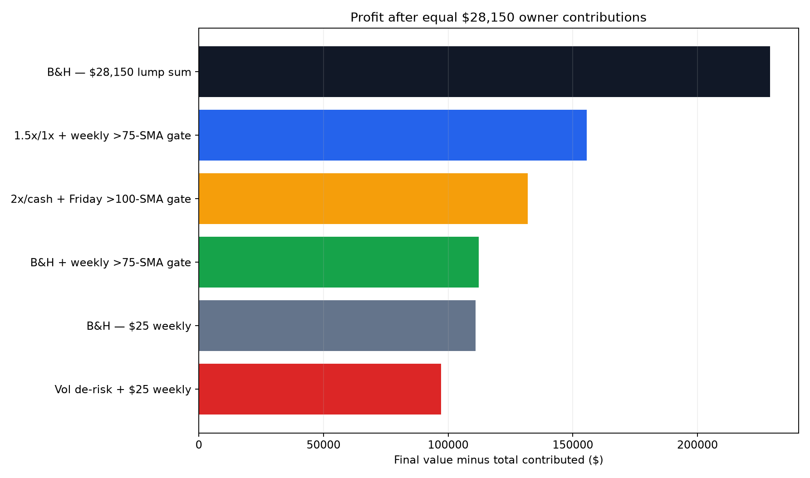
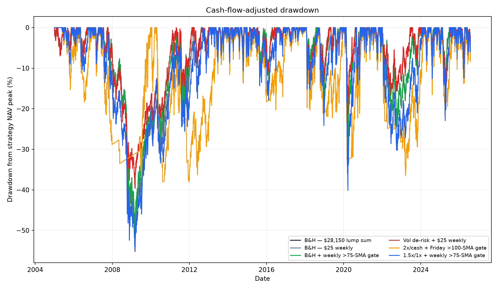

# SPY Weekly Strategy Status Check

**Period:** 2005-01-03 through 2026-07-30  
**Capital contributed to every strategy:** exactly **$28,150**  
**Weekly schedule:** 1,126 deposits × $25 = $28,150  
**Purpose:** determine whether the new strategies improved investment performance or merely finished higher because more money was deposited.

## Bottom Line

Your concern was valid. The previous combined report should not be compared directly with the old $10,000 lump-sum timing report because the combined accounts received **$28,150** over time.

After giving every strategy the same $28,150 of owner capital:

- **Lump-sum Buy & Hold finished highest at $257,205.70** because all $28,150 was compounding from the beginning.
- Weekly Buy & Hold finished at **$139,189.58** because most of its capital arrived years later.
- The best new weekly strategy finished at **$183,664.17**, below equal-capital lump-sum Buy & Hold but above weekly Buy & Hold.
- The best new strategy still showed a real time-weighted return advantage: **12.52% versus 10.78%** for weekly Buy & Hold. That improvement came from leverage, not from counting deposits as profit.
- The previous raw drawdowns were understated because deposits lifted the account value during declines. Cash-flow-adjusted drawdown gives a more honest comparison.

## Equal-Capital Comparison

| Strategy | Contribution pattern | Total contributed | Final value | Profit | IRR | Time-weighted CAGR | Adjusted max drawdown |
|---|---|---:|---:|---:|---:|---:|---:|
| B&H — $28,150 lump sum | All capital on first day | $28,150.00 | $257,205.70 | $229,055.70 | 10.80% | 10.80% | -55.22% |
| B&H — $25 weekly | 1,126 weekly deposits | $28,150.00 | $139,189.58 | $111,039.58 | 13.04% | 10.78% | -55.20% |
| B&H + weekly >75-SMA gate | 1,126 weekly deposits | $28,150.00 | $140,362.33 | $112,212.33 | 13.10% | 11.09% | -50.43% |
| Vol de-risk + $25 weekly | 1,126 weekly deposits | $28,150.00 | $125,308.31 | $97,158.31 | 12.25% | 10.47% | -39.61% |
| 2x/cash + Friday >100-SMA gate | 1,126 weekly deposits | $28,150.00 | $160,109.90 | $131,959.90 | 14.10% | 11.51% | -38.15% |
| 1.5x/1x + weekly >75-SMA gate | 1,126 weekly deposits | $28,150.00 | $183,664.17 | $155,514.17 | 15.10% | 12.52% | -54.95% |

## What the Return Numbers Mean

### Final value and profit

These are now safe to compare because every row received exactly $28,150. However, lump-sum Buy & Hold received that money on the first day, while the weekly strategies received it gradually. Earlier access to capital explains why lump-sum Buy & Hold produced the largest profit.

### IRR

IRR correctly treats every $25 deposit as an investor cash outflow; deposits are not counted as investment gains. But IRR is sensitive to when each deposit occurred. It answers, “What return did this investor experience on the dates their money entered?”

That is why weekly Buy & Hold shows a 13.04% IRR even though SPY's full-period lump-sum CAGR was about 10.80%.

### Time-weighted CAGR

Time-weighted return removes the effect of deposits and is the better measurement of the strategy itself. On this basis:

| Strategy | Time-weighted CAGR | Difference vs weekly B&H |
|---|---:|---:|
| 1.5x/1x + >75-SMA gate | 12.52% | +1.74 percentage points |
| 2x/cash + Friday >100-SMA gate | 11.51% | +0.73 percentage point |
| B&H + >75-SMA gate | 11.09% | +0.31 percentage point |
| Weekly B&H | 10.78% | baseline |
| Vol de-risk | 10.47% | -0.31 percentage point |

The new strategies did not outperform merely because of the deposits. But the strongest outperformance came from leverage. The unleveraged 75-SMA contribution gate added only about 0.31 percentage point annually.

## Profit

The lump-sum result is highest because the entire contribution was invested in 2005. Among accounts restricted to $25 weekly deposits, the 1.5x/1x strategy produced the most profit.

## Cash-Flow-Adjusted Drawdown

The corrected drawdowns materially change the risk interpretation:

| Strategy | Previous raw account drawdown | Cash-flow-adjusted drawdown |
|---|---:|---:|
| Weekly B&H | -38.10% | -55.20% |
| B&H + >75-SMA gate | -33.99% | -50.43% |
| Vol de-risk | -21.03% | -39.61% |
| 2x/cash + Friday >100-SMA gate | -35.12% | -38.15% |
| 1.5x/1x + >75-SMA gate | -39.96% | -54.95% |

Deposits during bear markets made the raw account-value curves look safer than the underlying strategy returns actually were. The adjusted calculation removes each deposit before calculating that day's performance.

## Status Assessment

### 1.5x/1x strategy

- Produced the strongest weekly-account return and profit.
- Its adjusted -54.95% drawdown was essentially as deep as Buy & Hold.
- The result is a leverage return enhancement, not a drawdown-control strategy.

### 2x/cash strategy

- Produced a genuine time-weighted advantage over Buy & Hold.
- Adjusted maximum drawdown improved to -38.15%.
- This was the most attractive historical return/drawdown trade-off in the quick comparison, but it depends on leverage, timing, borrowing costs, and rapid re-entry execution.

### 75-SMA weekly gate

- Added only $1,172.75 of final value over weekly Buy & Hold.
- Improved time-weighted CAGR by 0.31 percentage point.
- Reduced adjusted drawdown by about 4.77 percentage points.
- This remains a modest risk-management improvement rather than a major return edge.

### Volatility de-risk strategy

- Reduced adjusted drawdown by about 15.59 percentage points versus weekly Buy & Hold.
- Finished with $13,881.27 less profit than weekly Buy & Hold.
- It remains a risk-reduction choice, not a wealth-maximization choice.

## Conclusion

The corrected conclusion is more conservative than the first combined report:

1. **Equal-capital lump-sum Buy & Hold produced the most final wealth.**
2. **The new weekly strategies did not rise merely because deposits were counted as profit**, but their final values cannot be compared with the old $10,000 study without normalizing capital.
3. **The 1.5x/1x strategy's advantage was real but leverage-driven**, and its drawdown was almost as severe as Buy & Hold.
4. **The 2x/cash strategy had the strongest historical return/drawdown compromise**, although it carries substantial model and execution risk.
5. **The unleveraged weekly filters provided small improvements**, consistent with the original weekly study.

The suite now reports both time-weighted CAGR and cash-flow-adjusted maximum drawdown for timing studies with recurring contributions, preventing future deposits from being mistaken for performance or drawdown protection.
